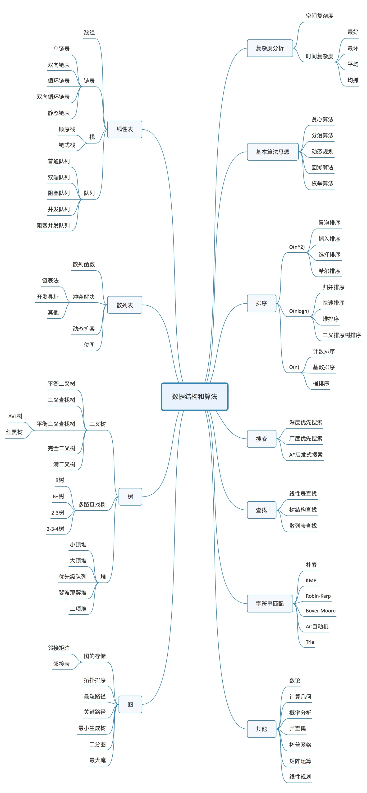

# 算法训练

## 0. Deliberate Practcing

#### 反复练习，五毒神掌

+ 第一遍： 读题，思考。 如果没有思路，直接看解法。
+ 第二遍：马上自己写，提交LeetCode
+ 第三遍：一天过后重复练习
+ 第四遍：一周之后重复练习
+ 第五遍：恢复性练习

#### 拆分知识点，练习缺陷和弱点

#### 寻求反馈

+ 主动反馈：高手代码
+ 被动反馈：高手指点

#### 切题四件套

+ Clarification：清理模糊点
+ Possible Solutions：暴力，优化
+ Coding
+ Test cases

## [1. Big(O)](./doc/big-o.md)

## [2. 数组](./doc/arr.md)/[链表](./doc/list.md)

## [3. 栈](doc/stack.md)/[队列](doc/queue.md)

## [4. 哈希](./doc/map-set.md)

## [5. 树](./doc/tree.md)

## [6. 平衡树](./doc/balance-tree.md)

## [7. 堆](./doc/heap.md)

## [8. 字典树](./doc/trie-tree.md)

## [9. 递归](./doc/recursion.md)

## [10. 深度/广度优先搜索](doc/dbfs.md)

## [11. 贪心算法](./doc/greedy.md)

## [12. 二分查找](./doc/search.md)

## [13. 动态规划](./doc/dp.md)

## [14. 并查集](./doc/dp.md)

## [15. 位运算](./doc/bit.md)

## [16. 排序](./doc/sort.md)

## [17. 字符串](./doc/pattern.md)
