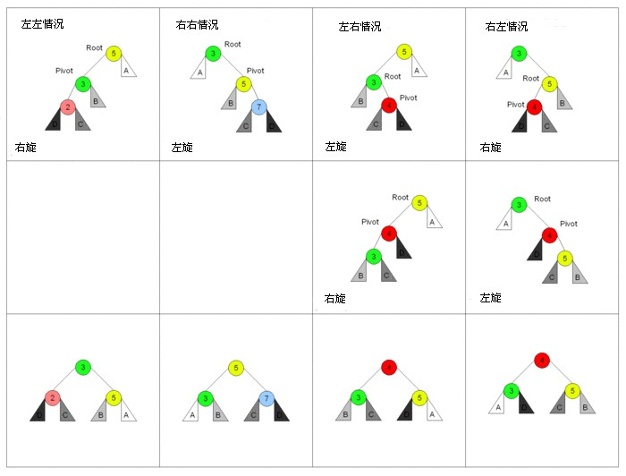

# 平衡树


## AVL树

平衡因子：右子树的高度减去左子树的高度，绝对值不大于1

每个节点会保存平衡因子，当平衡因子是-2或者2的时候会重新平衡这个树。


### 概述




+ 单向右旋平衡处理LL：由于在a的左子树根节点的左子树上插入节点，a的平衡因子由1增至2，则需进行一次右旋转操作
+ 单向左旋平衡处理RR：由于在a的右子树根节点的右子树上插入节点，a的平衡因子由-1变为-2，则需进行一次左旋转操作
+ 双向左右平衡处理LR：由于在a的左子树根节点的右子树上插入节点，a的平衡因子由1增至2，则需进行先左旋再右旋操作
+ 双向右左平衡处理RL：由于在a的右子树根节点的左子树上插入节点，a的平衡因子由-1变为-2，则需进行先右旋再左旋操作


### 实现

```JAVA
public class com.yufeng.data.structure.AVLTree<T extends Comparable<T>> {
    private AVLTreeNode<T> mRoot;    // 根结点

    // AVL树的节点(内部类)
    class AVLTreeNode<T extends Comparable<T>> {
        T key;                // 关键字(键值)
        int height;         // 高度
        AVLTreeNode<T> left;    // 左孩子
        AVLTreeNode<T> right;    // 右孩子

        public AVLTreeNode(T key, AVLTreeNode<T> left, AVLTreeNode<T> right) {
            this.key = key;
            this.left = left;
            this.right = right;
            this.height = 0;
        }
    }
    
    /*
     * 获取树的高度
     */
    private int height(AVLTreeNode<T> tree) {
        if (tree != null)
            return tree.height;

        return 0;
    }

    public int height() {
        return height(mRoot);
    }
    
    /*
     * 比较两个值的大小
     */
    private int max(int a, int b) {
        return a>b ? a : b;
    }
    
    /*
     * LL：左左对应的情况(左单旋转)。
     *
     * 返回值：旋转后的根节点
     */
    private AVLTreeNode<T> leftLeftRotation(AVLTreeNode<T> k2) {
        AVLTreeNode<T> k1;

        k1 = k2.left;
        k2.left = k1.right;
        k1.right = k2;

        k2.height = max( height(k2.left), height(k2.right)) + 1;
        k1.height = max( height(k1.left), k2.height) + 1;

        return k1;
    }
    
    /*
     * RR：右右对应的情况(右单旋转)。
     *
     * 返回值：旋转后的根节点
     */
    private AVLTreeNode<T> rightRightRotation(AVLTreeNode<T> k1) {
        AVLTreeNode<T> k2;

        k2 = k1.right;
        k1.right = k2.left;
        k2.left = k1;

        k1.height = max( height(k1.left), height(k1.right)) + 1;
        k2.height = max( height(k2.right), k1.height) + 1;

        return k2;
    }
    
    /*
     * LR：左右对应的情况(左双旋转)。
     *
     * 返回值：旋转后的根节点
     */
    private AVLTreeNode<T> leftRightRotation(AVLTreeNode<T> k3) {
        k3.left = rightRightRotation(k3.left);

        return leftLeftRotation(k3);
    }
    
    /*
     * RL：右左对应的情况(右双旋转)。
     *
     * 返回值：旋转后的根节点
     */
    private AVLTreeNode<T> rightLeftRotation(AVLTreeNode<T> k1) {
        k1.right = leftLeftRotation(k1.right);

        return rightRightRotation(k1);
    }
}    
```


## 红黑树

近似二叉平衡树，保证任何一个节点的左右子树的高度小于两倍

+ 节点是红色或黑色。

+ 根是黑色。

+ 所有叶子都是黑色（叶子是NIL节点）。

+ 每个红色节点必须有两个黑色的子节点。（从每个叶子到根的所有路径上不能有两个连续的红色节点。）

+ 从任一节点到其每个叶子的所有简单路径道路都包含相同数目的黑色节点。