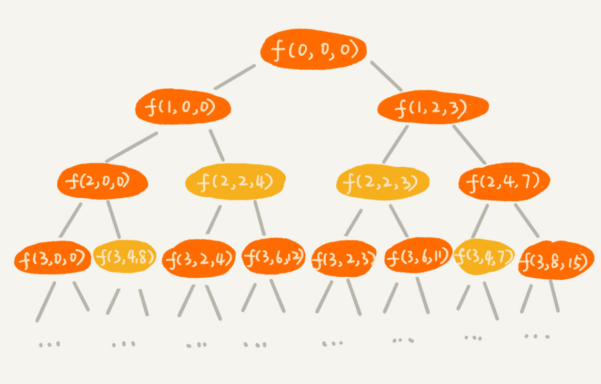

# 动态规划

## 概述

动态规划比较适合用来求解最优问题，比如求最大值、最小值等等。它可以非常显著地降低时间复杂度，提高代码的执行效率。

### 背包问题

我们假设背包的最大承载重量是 9。我们有 5 个不同的物品，每个物品的重量分别是 2，2，4，6，3。如果我们把这个例子的回溯求解过程，用递归树画出来，就是下面这个样子


递归树中的每个节点表示一种状态，我们用（i, cw）来表示。其中，i 表示将要决策第几个物品是否装入背包，cw 表示当前背包中物品的总重量。比如，（2，2）表示我们将要决策第 2 个物品是否装入背包，在决策前，背包中物品的总重量是 2。

我们把每一层重复的状态（节点）合并，只记录不同的状态，然后基于上一层的状态集合，来推导下一层的状态集合。我们可以通过合并每一层重复的状态，这样就保证每一层不同状态的个数都不会超过 w 个（w 表示背包的承载重量），也就是例子中的 9。于是，我们就成功避免了每层状态个数的指数级增长。

我们用一个**二维数组 states[n][w+1]，来记录每层可以达到的不同状态。**

第 0 个（下标从 0 开始编号）物品的重量是 2，**要么装入背包，要么不装入背包**，**决策完之后，会对应背包的两种状态，背包中物品的总重量是 0 或者 2。我们用 states[0][0]=true 和 states[0][2]=true 来表示这两种状态。**

第 1 个物品的重量也是 2，基于之前的背包状态，在这个物品决策完之后**，不同的状态有 3 个，背包中物品总重量分别是 0(0+0)，2(0+2 or 2+0)，4(2+2)。我们用 states[1][0]=true，states[1][2]=true，states[1][4]=true 来表示这三种状态。**


```JAVA
public int knapsack(int[] weight, int n, int w) {
  boolean[][] states = new boolean[n][w+1]; // 默认值false
  states[0][0] = true;  // 第一行的数据要特殊处理，可以利用哨兵优化
  if (weight[0] <= w) {
    states[0][weight[0]] = true;
  }
  for (int i = 1; i < n; ++i) { // 动态规划状态转移
    for (int j = 0; j <= w; ++j) {// 不把第i个物品放入背包
      if (states[i-1][j] == true) states[i][j] = states[i-1][j];
    }
    for (int j = 0; j <= w-weight[i]; ++j) {//把第i个物品放入背包
      if (states[i-1][j]==true) states[i][j+weight[i]] = true;
    }
  }
  for (int i = w; i >= 0; --i) { // 输出结果
    if (states[n-1][i] == true) return i;
  }
  return 0;
}
```

实际上，我们只需要一个大小为 w+1 的一维数组就可以解决这个问题。动态规划状态转移的过程，都可以基于这个一维数组来操作。

```JAVA
public static int knapsack2(int[] items, int n, int w) {
  boolean[] states = new boolean[w+1]; // 默认值false
  states[0] = true;  // 第一行的数据要特殊处理，可以利用哨兵优化
  if (items[0] <= w) {
    states[items[0]] = true;
  }
  for (int i = 1; i < n; ++i) { // 动态规划
    for (int j = w-items[i]; j >= 0; --j) {//把第i个物品放入背包
      if (states[j]==true) states[j+items[i]] = true;
    }
  }
  for (int i = w; i >= 0; --i) { // 输出结果
    if (states[i] == true) return i;
  }
  return 0;
}
```

**我们现在引入物品价值这一变量。**对于一组不同重量、不同价值、不可分割的物品，我们选择将某些物品装入背包，在满足背包最大重量限制的前提下，背包中可装入物品的总价值最大是多少呢？

针对上面的代码，我们还是照例画出递归树。在递归树中，每个节点表示一个状态。现在我们需要 3 个变量（i, cw, cv）来表示一个状态。其中，i 表示即将要决策第 i 个物品是否装入背包，cw 表示当前背包中物品的总重量，cv 表示当前背包中物品的总价值。



```JAVA
public static int knapsack3(int[] weight, int[] value, int n, int w) {
  int[][] states = new int[n][w+1];
  for (int i = 0; i < n; ++i) { // 初始化states
    for (int j = 0; j < w+1; ++j) {
      states[i][j] = -1;
    }
  }
  states[0][0] = 0;
  if (weight[0] <= w) {
    states[0][weight[0]] = value[0];
  }
  for (int i = 1; i < n; ++i) { //动态规划，状态转移
    for (int j = 0; j <= w; ++j) { // 不选择第i个物品
      if (states[i-1][j] >= 0) states[i][j] = states[i-1][j];
    }
    for (int j = 0; j <= w-weight[i]; ++j) { // 选择第i个物品
      if (states[i-1][j] >= 0) {
        int v = states[i-1][j] + value[i];
        if (v > states[i][j+weight[i]]) {
          states[i][j+weight[i]] = v;
        }
      }
    }
  }
  // 找出最大值
  int maxvalue = -1;
  for (int j = 0; j <= w; ++j) {
    if (states[n-1][j] > maxvalue) maxvalue = states[n-1][j];
  }
  return maxvalue;
}
```


### 最短距离

假设我们有一个 n 乘以 n 的矩阵 w[n][n]。矩阵存储的都是正整数。棋子起始位置在左上角，终止位置在右下角。我们将棋子从左上角移动到右下角。每次只能向右或者向下移动一位。从左上角到右下角，会有很多不同的路径可以走。我们把每条路径经过的数字加起来看作路径的长度。那从左上角移动到右下角的最短路径长度是多少呢？


从 (0, 0) 走到 (n-1, n-1)，总共要走 2\*(n-1) 步，也就对应着 2*(n-1) 个阶段。**每个阶段都有向右走或者向下走两种决策**，**并且每个阶段都会对应一个状态集合。**

我们把状态定义为 min_dist(i, j)，其中 i 表示行，j 表示列。min_dist 表达式的值表示从 (0, 0) 到达 (i, j) 的最短路径长度。所以，**这个问题是一个多阶段决策最优解问题，符合动态规划的模型。**


我们可以用回溯算法来解决这个问题。如果你自己写一下代码，画一下递归树，就会发现，递归树中有重复的节点。重复的节点表示，从左上角到节点对应的位置，有多种路线，这也能说明这个问题中存在重复子问题。


```java
private int minDist = Integer.MAX_VALUE; // 全局变量或者成员变量
// 调用方式：minDistBacktracing(0, 0, 0, w, n);
public void minDistBT(int i, int j, int dist, int[][] w, int n) {
  // 到达了n-1, n-1这个位置了，这里看着有点奇怪哈，你自己举个例子看下
  if (i == n && j == n) {
    if (dist < minDist) minDist = dist;
    return;
  }
  if (i < n) { // 往下走，更新i=i+1, j=j
    minDistBT(i + 1, j, dist+w[i][j], w, n);
  }
  if (j < n) { // 往右走，更新i=i, j=j+1
    minDistBT(i, j+1, dist+w[i][j], w, n);
  }
}
```


### 动态规划vs贪心vs分治vs回溯

+ **分治**：大部分也是最优解问题，但是，大部分都不能抽象成多阶段决策模型。
+ **回溯**：回溯算法相当于穷举搜索。穷举所有的情况，然后对比得到最优解。不过，回溯算法的时间复杂度是指数级别的，只能用来解决小规模数据的问题。对于大规模数据的问题，用回溯算法解决的执行效率就很低了
+ **贪心**：通过局部最优的选择，但是全局未必是最优解
+ **动态规划**：需要满足三个特征，最优子结构、无后效性和重复子问题


### 解题思路

#### 状态定义/转移

+ **找到状态和选择**
  + **状态**：有几种参数决定状态就是几维DP
  + **选择**：从上一个状态迁移到现在状态有几种选择，并从中择优
+ 明确 dp 数组/函数的定义 
+ 寻找状态之间的关系

#### 代码

+ 最优子结构 opt[n] = best_of(opt[n-1], opt[n -2], ...)
+ 存储中间状态 opt[i]
+ 递推公式

```python
for 状态1 in 状态1的所有取值：
    for 状态2 in 状态2的所有取值：
        for ...
            dp[状态1][状态2][...] = 择优(选择1，选择2...)
```


## 习题
| 序号 | 题目                                                         | 次数 |
| ---- | ------------------------------------------------------------ | ---- |
| 62   | [不同路径](https://leetcode-cn.com/problems/unique-paths/)   | 1    |
| 63   | [不同路径 II](https://leetcode-cn.com/problems/unique-paths-ii/) | 1    |
| 1143 | [最长公共子序列](https://leetcode-cn.com/problems/longest-common-subsequence/) | 1    |
| 70   | [爬楼梯](https://leetcode-cn.com/problems/climbing-stairs/)  | 1    |
| 120  | [三角形最小路径和](https://leetcode-cn.com/problems/triangle/) | 1    |
| 53   | [最大子序和](https://leetcode-cn.com/problems/maximum-subarray/) | 1    |
| 152  | [乘积最大子数组](https://leetcode-cn.com/problems/maximum-product-subarray/) | 1    |
| 198  | [打家劫舍](https://leetcode-cn.com/problems/house-robber/)   | 1    |
| 213  | [打家劫舍 II](https://leetcode-cn.com/problems/house-robber-ii/) | 1    |
| 121  | [买卖股票的最佳时机](https://leetcode-cn.com/problems/best-time-to-buy-and-sell-stock/) | 3    |
| 122  | [买卖股票的最佳时机 II](https://leetcode-cn.com/problems/best-time-to-buy-and-sell-stock-ii/) | 2    |
| 309  | [最佳买卖股票时机含冷冻期](https://leetcode-cn.com/problems/best-time-to-buy-and-sell-stock-with-cooldown/) | 1    |
| 123  | [买卖股票的最佳时机 III](https://leetcode-cn.com/problems/best-time-to-buy-and-sell-stock-iii/) | 1    |
| 188  | [买卖股票的最佳时机 IV](https://leetcode-cn.com/problems/best-time-to-buy-and-sell-stock-iv/) | 1    |
| 300  | [最长上升子序列](https://leetcode-cn.com/problems/longest-increasing-subsequence/) | 1    |
| 32   | [最长有效括号](https://leetcode-cn.com/problems/longest-valid-parentheses/) | 1    |
| 818  | [赛车](https://leetcode-cn.com/problems/race-car/)           | 1    |
| 746  | [使用最小花费爬楼梯](https://leetcode-cn.com/problems/min-cost-climbing-stairs/) | 1    |
| 72   | [编辑距离](https://leetcode-cn.com/problems/edit-distance/)  | 1    |


