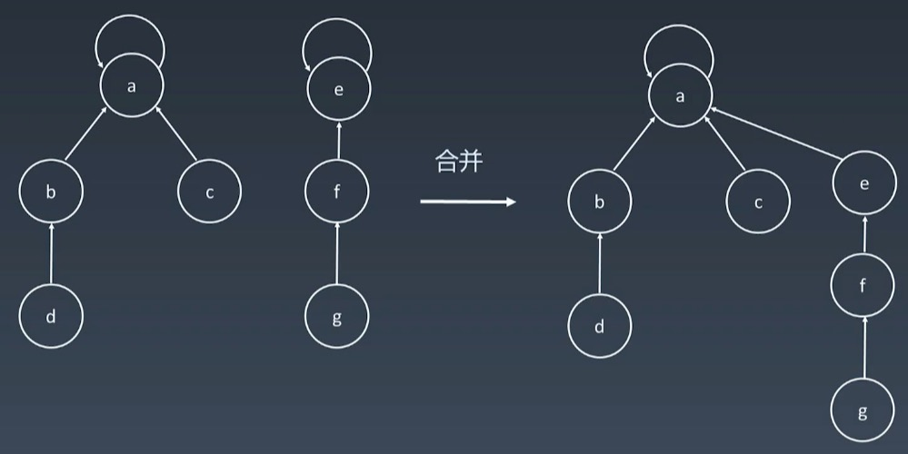

# 并查集

| 序号 | 题目次数                                                     | 次数 |
| ---- | ------------------------------------------------------------ | ---- |
| 547  | [省份数量](https://leetcode-cn.com/problems/number-of-provinces/) | 1    |
| 200  | [岛屿数量](https://leetcode-cn.com/problems/number-of-islands/) |      |
| 130  | [被围绕的区域](https://leetcode-cn.com/problems/surrounded-regions/) |      |
|      |                                                              |      |


## 概述

并查集用于组团或者配对，数组用于实现，指向自己的父亲

+ makeSet: 创建集合
+ unionSet: 合并集合
+ find(x)： 找到元素x**所在集合的代表**




## 实现

```java
class Union {

        int[] parent;
        int count;

        public Union(int i) {
            parent = new int[i];
            this.count = i;
            for(int k = 0; k < parent.length; k++) {
                parent[k] = k;
            }
        }


        public int find(int p) {
            int root = p;
            while(root != parent[root]) {
                root = parent[root]; 
            }
					
            //压缩路径
            int i = p;
            while(root != parent[i]) {
                int next = parent[i];
                parent[i] = root;
                i = next;
            }
            return root;
        }

        public void union(int p, int q) {
            int rootP = find(p);
            int rootQ = find(q);
            if (rootP == rootQ) return;
            parent[rootP] = rootQ;
            count--;
        }
    }
```


## 应用

分组

+ 朋友圈
+ 独立集合


## 例题