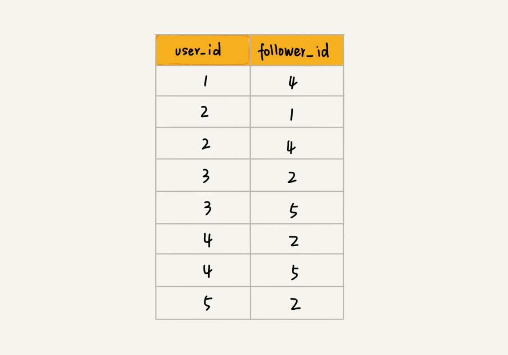
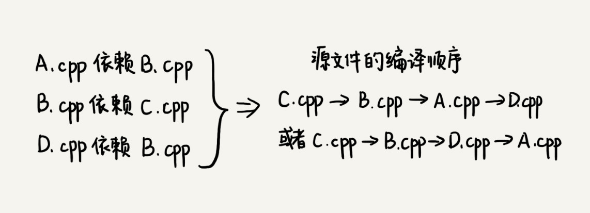

# 图

## 概述

图中的元素我们就叫做**顶点vertex。**

图中的一个顶点可以与任意其他顶点建立连接关系。我们把这种建立的关系叫做**边edge**。


顶点的**度degree**就是跟顶点相连接的边的条数。

+ 顶点的入度，表示有多少条边指向这个顶点
+ 顶点的出度，表示有多少条边是以这个顶点为起点指向其他顶点。


**带权图（weighted graph）**。在带权图中，每条边都有一个权重（weight）


### 邻接矩阵存储

邻接矩阵的底层依赖一个二维数组。

+ 对于无向图来说，如果顶点 i 与顶点 j 之间有边，我们就将 A[i][j]和 A[j][i]标记为 1
+ 对于有向图来说，如果顶点 i 到顶点 j 之间，有一条箭头从顶点 i 指向顶点 j 的边，那我们就将 A[i][j]标记为


如果我们存储的是稀疏图（Sparse Matrix），也就是说，顶点很多，但每个顶点的边并不多，那邻接矩阵的存储方法就更加浪费空间了


### 邻接表存储方法

每个顶点对应一条链表，链表中存储的是与这个顶点相连接的其他顶点。


## 应用

### 微博实例

针对微博用户关系，假设我们需要支持下面这样几个操作：

+ 判断用户 A 是否关注了用户 B；
+ 判断用户 A 是否是用户 B 的粉丝；
+ 用户 A 关注用户 B；用户 A 取消关注用户 B；
+ 根据用户名称的首字母排序，分页获取用户的粉丝列表；
+ 根据用户名称的首字母排序，分页获取用户的关注列表。

邻接表来存储这种有向图是不够的。我们去查找某个用户关注了哪些用户非常容易，但是如果要想知道某个用户都被哪些用户关注了，也就是用户的粉丝列表，是非常困难的。

需要一个逆邻接表。**邻接表中存储了用户的关注关系，逆邻接表中存储的是用户的被关注关系。**


如果对于小规模的数据，比如社交网络中只有几万、几十万个用户，我们可以将整个社交关系存储在内存中。

**数据规模太大，我们可以通过哈希算法等数据分片方式，将邻接表存储在不同的机器上。**你可以看下面这幅图，我们在机器 1 上存储顶点 1，2，3 的邻接表，在机器 2 上，存储顶点 4，5 的邻接表。逆邻接表的处理方式也一样。当要查询顶点与顶点关系的时候，我们就利用同样的哈希算法，先定位顶点所在的机器，然后再在相应的机器上查找。





### 拓扑排序

一个完整的项目往往会包含很多代码源文件。编译器在编译整个项目的时候，需要按照依赖关系，依次编译每个源文件。比如，A.cpp 依赖 B.cpp，那在编译的时候，编译器需要先编译 B.cpp，才能编译 A.cpp

编译器通过分析源文件或者程序员事先写好的编译配置文件（比如 Makefile 文件），来获取这种局部的依赖关系。



#### Kahn 算法

定义数据结构的时候，如果 s 需要先于 t 执行，那就添加一条 s 指向 t 的边。所以，如果某个顶点入度为 0， 也就表示，没有任何顶点必须先于这个顶点执行，那么这个顶点就可以执行了。

我们先从图中，找出一个入度为 0 的顶点，将其输出到拓扑排序的结果序列中，并且把这个顶点从图中删除（**也就是把这个顶点可达的顶点的入度都减 1**）。我们循环执行上面的过程，直到所有的顶点都被输出。最后输出的序列，就是满足局部依赖关系的拓扑排序。

```JAVA
public void topoSortByKahn() {
  int[] inDegree = new int[v]; // 统计每个顶点的入度
  for (int i = 0; i < v; ++i) {
    for (int j = 0; j < adj[i].size(); ++j) {
      int w = adj[i].get(j); // i->w
      inDegree[w]++;
    }
  }
  LinkedList<Integer> queue = new LinkedList<>();
  for (int i = 0; i < v; ++i) {
    if (inDegree[i] == 0) queue.add(i);
  }
  while (!queue.isEmpty()) {
    int i = queue.remove();
    System.out.print("->" + i);
    for (int j = 0; j < adj[i].size(); ++j) {
      int k = adj[i].get(j);
      inDegree[k]--;
      if (inDegree[k] == 0) queue.add(k);
    }
  }
}
```

#### DFS算法

第一部分是通过邻接表构造逆邻接表

第二部分是这个算法的核心，**也就是递归处理每个顶点。对于顶点 vertex 来说，我们先输出它可达的所有顶点，也就是说，先把它依赖的所有的顶点输出了，然后再输出自己。**

```JAVA
public void topoSortByDFS() {
  // 先构建逆邻接表，边s->t表示，s依赖于t，t先于s
  LinkedList<Integer> inverseAdj[] = new LinkedList[v];
  for (int i = 0; i < v; ++i) { // 申请空间
    inverseAdj[i] = new LinkedList<>();
  }
  for (int i = 0; i < v; ++i) { // 通过邻接表生成逆邻接表
    for (int j = 0; j < adj[i].size(); ++j) {
      int w = adj[i].get(j); // i->w
      inverseAdj[w].add(i); // w->i
    }
  }
  boolean[] visited = new boolean[v];
  for (int i = 0; i < v; ++i) { // 深度优先遍历图
    if (visited[i] == false) {
      visited[i] = true;
      dfs(i, inverseAdj, visited);
    }
  }
}

private void dfs(
    int vertex, LinkedList<Integer> inverseAdj[], boolean[] visited) {
  for (int i = 0; i < inverseAdj[vertex].size(); ++i) {
    int w = inverseAdj[vertex].get(i);
    if (visited[w] == true) continue;
    visited[w] = true;
    dfs(w, inverseAdj, visited);
  } // 先把vertex这个顶点可达的所有顶点都打印出来之后，再打印它自己
  System.out.print("->" + vertex);
}
```


### 最短路径

把地图抽象成图最合适不过了，把每个岔路口看作一个顶点，岔路口与岔路口之间的路看作一条边，路的长度就是边的权重。如果路是单行道，我们就在两个顶点之间画一条有向边；如果路是双行道，我们就在两个顶点之间画两条方向不同的边。这样，整个地图就被抽象成一个有向有权图。

#### Dijkstra 算法

我们用 vertexes 数组，记录从起始顶点到每个顶点的距离（dist）。起初，我们把所有顶点的 dist 都初始化为无穷大（也就是代码中的 Integer.MAX_VALUE）。我们把起始顶点的 dist 值初始化为 0，然后将其放到优先级队列中。

**我们从优先级队列中取出 dist 最小的顶点 minVertex，然后考察这个顶点可达的所有顶点（代码中的 nextVertex）**。如果 minVertex 的 dist 值加上 minVertex 与 nextVertex 之间边的权重 w 小于 nextVertex 当前的 dist 值，也就是说，存在另一条更短的路径，它经过 minVertex 到达 nextVertex。那我们就把 nextVertex 的 dist 更新为 minVertex 的 dist 值加上 w。然后，我们把 nextVertex 加入到优先级队列中。重复这个过程，直到找到终止顶点 t 或者队列为空。

```JAVA
public class Graph { // 有向有权图的邻接表表示
  private LinkedList<Edge> adj[]; // 邻接表
  private int v; // 顶点个数

  public Graph(int v) {
    this.v = v;
    this.adj = new LinkedList[v];
    for (int i = 0; i < v; ++i) {
      this.adj[i] = new LinkedList<>();
    }
  }

  public void addEdge(int s, int t, int w) { // 添加一条边
    this.adj[s].add(new Edge(s, t, w));
  }

  private class Edge {
    public int sid; // 边的起始顶点编号
    public int tid; // 边的终止顶点编号
    public int w; // 权重
    public Edge(int sid, int tid, int w) {
      this.sid = sid;
      this.tid = tid;
      this.w = w;
    }
  }
  // 下面这个类是为了dijkstra实现用的
  private class Vertex {
    public int id; // 顶点编号ID
    public int dist; // 从起始顶点到这个顶点的距离
    public Vertex(int id, int dist) {
      this.id = id;
      this.dist = dist;
    }
  }
}


// 因为Java提供的优先级队列，没有暴露更新数据的接口，所以我们需要重新实现一个
private class PriorityQueue { // 根据vertex.dist构建小顶堆
  private Vertex[] nodes;
  private int count;
  public PriorityQueue(int v) {
    this.nodes = new Vertex[v+1];
    this.count = v;
  }
  public Vertex poll() { // TODO: 留给读者实现... }
  public void add(Vertex vertex) { // TODO: 留给读者实现...}
  // 更新结点的值，并且从下往上堆化，重新符合堆的定义。时间复杂度O(logn)。
  public void update(Vertex vertex) { // TODO: 留给读者实现...} 
  public boolean isEmpty() { // TODO: 留给读者实现...}
}

public void dijkstra(int s, int t) { // 从顶点s到顶点t的最短路径
  int[] predecessor = new int[this.v]; // 用来还原最短路径
  Vertex[] vertexes = new Vertex[this.v];
  for (int i = 0; i < this.v; ++i) {
    vertexes[i] = new Vertex(i, Integer.MAX_VALUE);
  }
  PriorityQueue queue = new PriorityQueue(this.v);// 小顶堆
  boolean[] inqueue = new boolean[this.v]; // 标记是否进入过队列
  vertexes[s].dist = 0;
  queue.add(vertexes[s]);
  inqueue[s] = true;
  while (!queue.isEmpty()) {
    Vertex minVertex= queue.poll(); // 取堆顶元素并删除
    if (minVertex.id == t) break; // 最短路径产生了
    for (int i = 0; i < adj[minVertex.id].size(); ++i) {
      Edge e = adj[minVertex.id].get(i); // 取出一条minVetex相连的边
      Vertex nextVertex = vertexes[e.tid]; // minVertex-->nextVertex
      if (minVertex.dist + e.w < nextVertex.dist) { // 更新next的dist
        nextVertex.dist = minVertex.dist + e.w;
        predecessor[nextVertex.id] = minVertex.id;
        if (inqueue[nextVertex.id] == true) {
          queue.update(nextVertex); // 更新队列中的dist值
        } else {
          queue.add(nextVertex);
          inqueue[nextVertex.id] = true;
        }
      }
    }
  }
  // 输出最短路径
  System.out.print(s);
  print(s, t, predecessor);
}

private void print(int s, int t, int[] predecessor) {
  if (s == t) return;
  print(s, predecessor[t], predecessor);
  System.out.print("->" + t);
}
```


#### A* 算法

Dijkstra 算法有点儿类似 BFS 算法，它每次找到跟起点最近的顶点，往外扩展。这种往外扩展的思路，其实有些盲目


在 Dijkstra 算法的实现思路中，我们用一个优先级队列，来记录已经遍历到的顶点以及这个顶点与起点的路径长度。顶点与起点路径长度越小，就越先被从优先级队列中取出来扩展，尽管我们找的是从 s 到 t 的路线，**但是最先被搜索到的顶点依次是 1，2，3**。这个搜索方向跟我们**期望的路线方向是反着的，路线搜索的方向明显“跑偏”了。**

**我们可以通过欧几里得距离，来近似地估计这个顶点跟终点的路径长度**。我们把这个距离记作 h(i)（i 表示这个顶点的编号），专业的叫法是启发函数（heuristic function）。**因为欧几里得距离的计算公式，会涉及比较耗时的开根号计算，所以，我们一般通过另外一个更加简单的距离计算公式，那就是曼哈顿距离（Manhattan distance）**

```JAVA
int hManhattan(Vertex v1, Vertex v2) { // Vertex表示顶点，后面有定义
  return Math.abs(v1.x - v2.x) + Math.abs(v1.y - v2.y);
}
```

原来只是单纯地通过顶点与起点之间的路径长度 g(i)，来判断谁先出队列，现在有了顶点到终点的路径长度估计值，我们通过两者之和 f(i)=g(i)+h(i)，来判断哪个顶点该最先出队列。综合两部分，我们就能有效避免刚刚讲的“跑偏”。**这里 f(i) 的专业叫法是估价函数（evaluation function）。**

```JAVA
public void astar(int s, int t) { // 从顶点s到顶点t的路径
  int[] predecessor = new int[this.v]; // 用来还原路径
  // 按照vertex的f值构建的小顶堆，而不是按照dist
  PriorityQueue queue = new PriorityQueue(this.v);
  boolean[] inqueue = new boolean[this.v]; // 标记是否进入过队列
  vertexes[s].dist = 0;
  vertexes[s].f = 0;
  queue.add(vertexes[s]);
  inqueue[s] = true;
  while (!queue.isEmpty()) {
    Vertex minVertex = queue.poll(); // 取堆顶元素并删除
    for (int i = 0; i < adj[minVertex.id].size(); ++i) {
      Edge e = adj[minVertex.id].get(i); // 取出一条minVetex相连的边
      Vertex nextVertex = vertexes[e.tid]; // minVertex-->nextVertex
      if (minVertex.dist + e.w < nextVertex.dist) { // 更新next的dist,f
        nextVertex.dist = minVertex.dist + e.w;
        nextVertex.f 
           = nextVertex.dist+hManhattan(nextVertex, vertexes[t]);
        predecessor[nextVertex.id] = minVertex.id;
        if (inqueue[nextVertex.id] == true) {
          queue.update(nextVertex);
        } else {
          queue.add(nextVertex);
          inqueue[nextVertex.id] = true;
        }
      }
      if (nextVertex.id == t) { // 只要到达t就可以结束while了
        queue.clear(); // 清空queue，才能推出while循环
        break; 
      }
    }
  }
  // 输出路径
  System.out.print(s);
  print(s, t, predecessor); // print函数请参看Dijkstra算法的实现
}
```

对于 A* 算法来说，一旦遍历到终点，我们就结束 while 循环，这个时候，**终点的 dist 值未必是最小值。A*** 算法利用贪心算法的思路，每次都找 f 值最小的顶点出队列，**一旦搜索到终点就不在继续考察其他顶点和路线了。所以，它并没有考察所有的路线，也就不可能找出最短路径了。**