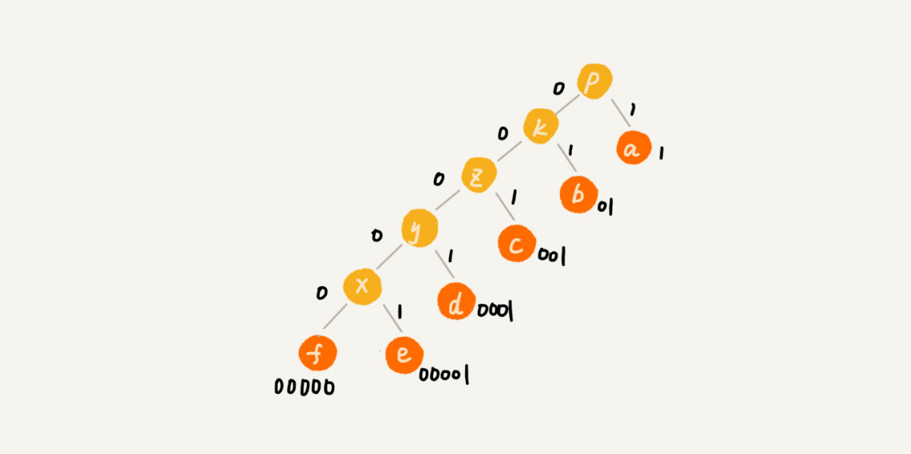

# 贪心算法

## 概述

+ **首先要联想到贪心算法**：针对一组数据，我们定义了**限制值和期望值**，希望从中选出几个数据，在**满足限制值的情况下，期望值最大。**

+ **尝试看下这个问题是否可以用贪心算法解决**：每次选择当前情况下，**在对限制值同等贡献量的情况下，对期望值贡献最大的数据。**

+ 举几个例子看下贪心算法产生的结果是否是最优的

贪心算法的解决思路是，每次都选择一条跟当前顶点相连的权最小的边，直到找到顶点 T。按照这种思路，我们求出的最短路径是 S->A->E->T，路径长度是 1+4+4=9。

但是，这种贪心的选择方式的最终求的路径并不是最短路径，因为路径 S->B->D->T 才是最短路径，因为这条路径的长度是 2+2+2=6。**局部最优解不等于全局最优解。**


## 实例

### 分糖果

我们有 m 个糖果和 n 个孩子。我们现在要把糖果分给这些孩子吃，但是糖果少，孩子多（m<n），所以糖果只能分配给一部分孩子。

我们可以把这个问题抽象成，从 n 个孩子中，抽取一部分孩子分配糖果，让满足的孩子的个数（期望值）是最大的。这个问题的限制值就是糖果个数 m。我们每次从剩下的孩子中，找出对糖果大小需求最小的，然后发给他剩下的糖果中能满足他的最小的糖果，这样得到的分配方案，也就是满足的孩子个数最多的方案。


### 钱币找零

在生活中，我们肯定是先用面值最大的来支付，如果不够，就继续用更小一点面值的，以此类推，最后剩下的用 1 元来补齐。在贡献相同期望值（纸币数目）的情况下，我们希望多贡献点金额，这样就可以让纸币数更少，这就是一种贪心算法的解决思路。


### 区间覆盖

假设我们有 n 个区间，区间的起始端点和结束端点分别是[l1, r1]，[l2, r2]，[l3, r3]，……，[ln, rn]。我们从这 n 个区间中选出一部分区间，这部分区间满足两两不相交（端点相交的情况不算相交），最多能选出多少个区间呢？


我们每次选择的时候，左端点跟前面的已经覆盖的区间不重合的，右端点又尽量小的，这样可以让剩下的未覆盖区间尽可能的大，就可以放置更多的区间。这实际上就是一种贪心的选择方法。


## 霍夫曼编码应用

假设我有一个包含 1000 个字符的文件，每个字符占 1 个 byte（1byte=8bits），存储这 1000 个字符就一共需要 8000bits，

假设我们通过统计分析发现，**这 1000 个字符中只包含 6 种不同字符，假设它们分别是 a、b、c、d、e、f。而 3 个二进制位（bit）就可以表示 8 个不同的字符，**所以，为了尽量减少存储空间，每个字符我们用 3 个二进制位来表示。那存储这 1000 个字符只需要 3000bits 就可以了

```
a(000)、b(001)、c(010)、d(011)、e(100)、f(101)
```

假设这 6 个字符出现的频率从高到低依次是 a、b、c、d、e、f。我们把它们编码下面这个样子，**任何一个字符的编码都不是另一个的前缀，在解压缩的时候，我们每次会读取尽可能长的可解压的二进制串，**所以在解压缩的时候也不会歧义。经过这种编码压缩之后，这 1000 个字符只需要 2100bits 就可以了。





## 习题

| 序号 | 题目                                                         | 链接 |
| ---- | ------------------------------------------------------------ | ---- |
| 860  | [柠檬水找零](https://leetcode-cn.com/problems/lemonade-change/) | 1    |
| 122  | [买卖股票的最佳时机 II](https://leetcode-cn.com/problems/best-time-to-buy-and-sell-stock-ii/) | 1    |
| 455  | [分发饼干](https://leetcode-cn.com/problems/assign-cookies/) | 1    |
| 874  | [模拟行走机器人](https://leetcode-cn.com/problems/walking-robot-simulation/) | 1    |
| 55   | [跳跃游戏](https://leetcode-cn.com/problems/jump-game/)      | 1    |
| 45   | [跳跃游戏 II](https://leetcode-cn.com/problems/jump-game-ii/) | 1    |

