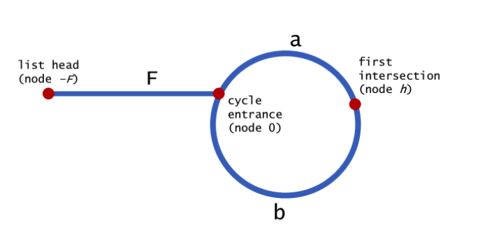

# 链表

链表不需要一块连续的内存空间，它通过“指针”将一组零散的内存块串联起来使用


## 应用

LRU Least Recent Used, 最近最少使用

+ 如果此数据之前已经被缓存在链表中了，我们遍历得到这个数据对应的结点，并将其从原来的位置删除，然后再插入到链表的头部。
+ 如果此数据没有在缓存链表中，又可以分为两种情况
  + 如果此时缓存未满，则将此结点直接插入到链表的头部
  + 如果此时缓存已满，则链表尾结点删除，将新的数据结点插入链表的头部

```JAVA
class LRUCache {

    LinkedList<Integer> list;
    Map<Integer, Integer> map;
    int capacity;

    public LRUCache(int capacity) {
        this.list = new LinkedList<>();
        this.map = new HashMap<>();
        this.capacity = capacity;
    }
    
    public int get(int key) {
        if (!map.containsKey(key)) return -1;
        list.remove((Object)key);
        list.addFirst(key);
        return map.get(key);
    }
    
    public void put(int key, int value) {

        map.put(key, value);
        list.remove((Object)key);

        list.addFirst(key);
        if (list.size() > capacity) {
            key = list.get(capacity);
            list.removeLast();
            map.remove(key);
        }
    }
}
```


## 常用技巧

### 初始条件

可正可负， 是否处理0， 链表和数组是否有已知长度


### 哨兵

引入哨兵结点，在任何时候，不管链表是不是空，head 指针都会一直指向这个哨兵结点。我们也把这种有哨兵结点的链表叫带头链表


### 边界

+ 如果链表为空时
+ 如果链表只包含一个结点时
+ 如果链表只包含两个结点时
+ 代码逻辑在处理头结点和尾结点的时候


### 画图


## 习题

| 序号 | 题目                                                         | 次数 |
| ---- | ------------------------------------------------------------ | ---- |
| 206  | [反转链表](https://leetcode-cn.com/problems/reverse-linked-list/) | 4    |
| 24   | [两两交换链表中的节点](https://leetcode-cn.com/problems/swap-nodes-in-pairs/) | 4    |
| 25   | [K 个一组翻转链表](https://leetcode-cn.com/problems/reverse-nodes-in-k-group/) | 4    |
| 234  | [回文链表](https://leetcode-cn.com/problems/palindrome-linked-list/) | 2    |
| 141  | [环形链表](https://leetcode-cn.com/problems/linked-list-cycle/) | 4    |
| 142  | [环形链表 II](https://leetcode-cn.com/problems/linked-list-cycle-ii/) | 4    |
| 2    | [两数相加](https://leetcode-cn.com/problems/add-two-numbers/) | 2    |
| 160  | [相交链表](https://leetcode-cn.com/problems/intersection-of-two-linked-lists/) | 1    |
| 19   | [删除链表的倒数第N个节点](https://leetcode-cn.com/problems/remove-nth-node-from-end-of-list/) | 2    |
| 328  | [奇偶链表](https://leetcode-cn.com/problems/odd-even-linked-list/) | 1    |
| 61   | [旋转链表](https://leetcode-cn.com/problems/rotate-list/)    | 1    |
| 430  | [扁平化多级双向链表](https://leetcode-cn.com/problems/flatten-a-multilevel-doubly-linked-list/) | 1    |


### 链表翻转

#### 循环反转

循环到当前节点为NULL位置，NULL之前的节点都已经完成翻转

如果只有一个节点，那么头节点还是执行一次，因为prev设置成NULL

**head == null || head.next == null 为最基础单元**

**prev一定比curr先移动**

```JAVA
class Solution {
    
    public ListNode reverseList(ListNode head) {
        if (head == null || head.next == null) {
            return head;
        }

        ListNode next = head.next;
        ListNode newHead = reverseList(next);
        next.next = head;
        head.next = null;

        return newHead;
    }
}
```


#### 递归反转

**假设后面的链表已经反转好了**

找出最简单的case, 最小任务是当前节点没有下一个节点

curr.next 必须设置为NULL，不然头节点会形成环链表

```java
class Solution {
    public ListNode reverseList(ListNode head) {
        if (head == null || head.next == null) {
            return head;
        }

        ListNode prev = null;
        ListNode curr = head;
        ListNode next;
        while (curr != null) {
            next = curr.next;
            curr.next = prev;

            prev = curr;
            curr = next;
        }
        return prev;
    }
}
```


### 两两反转链表

#### 循环交换

无论当前子链表是否翻转，**都需要把主链连接到子链边**

**利用dummyHead来简化head的指针变化**

```java
class Solution {
    public ListNode swapPairs(ListNode head) {

        if (head == null || head.next == null) return head;

        ListNode prev = new ListNode(0);
        prev.next = head;

        ListNode next = null, node1 = head, node2 = head.next,  dummyHead = prev;
        while (node1 != null && node2 != null) {
            
            // get node1, node2, next
            node2 = node1.next;
            next = node2.next;

            // relink
            node2.next = node1;
            node1.next = next;
            prev.next = node2;

            // move
            prev = node1;
            node1 = next;
        }

        return dummyHead.next;
    }
}
```


#### 递归交换

假设后面已经两两交换完成

当前必须node和node.next 同时存在才交换，否则说明已经到达终点

```JAVA
class Solution {
    public ListNode swapPairs(ListNode head) {

        if (head == null || head.next == null) return head;

        ListNode first = head;
        ListNode second = head.next;
        ListNode next = swapPairs(second.next);

        first.next = next;
        second.next = first;
        return second;
    }
}
```


### K 个一组翻转链表

#### 循环交换

获取curr，last 和 next

**注意子链表重新链接主链表的节点位置，画图求解**

```java
class Solution {
    public ListNode reverseKGroup(ListNode head, int k) {

        if (head == null || head.next == null) return head;

        ListNode dummyHead = new ListNode(0);
        dummyHead.next = head;

        ListNode curr = head, node = curr, prev = dummyHead, last = null, next = null;
         while(curr != null) {

            // get last
            int i = 1;
            node = curr;
            while(node != null && i < k) {
                node = node.next;
                i++;
            }
            if (node == null) break;
            last = node;
            next = last.next;

            // reverse
            last.next = null;
            node = curr;
            reverseList(node);
            prev.next = last;
            curr.next = next;

            prev = curr;
            curr = next;
        }

        return dummyHead.next;
    }

    public void reverseList(ListNode head) {

        if (head == null || head.next == null) return;

        ListNode prev = null, next = null;
        while(head != null) {
            next = head.next;
            head.next = prev;

            prev = head;
            head = next;
        }
    }
}
```


#### 递归交换

**先反转子链表，再反转当前链表**

返回当前链表的头结点

```JAVA
class Solution {
    public ListNode reverseKGroup(ListNode head, int k) {

        if (head == null || head.next == null) return head;

        int i = 1;
        ListNode node = head, curr = node;
        while (node != null && i < k) {
            node = node.next;
            i++;
        }
        if (node == null) return curr;

        ListNode last = node;
        ListNode next = last.next;

        node = curr;
        ListNode subList = reverseKGroup(next, k);
        last.next = null;

        ListNode currHead = reverseSubList(node);
        curr.next = subList;

        return currHead;
    }

    public ListNode reverseSubList(ListNode head) {

        if (head == null || head.next == null) return head;

        ListNode next = head.next;
        ListNode newHead = reverseSubList(next);
        next.next = head;
        head.next = null;
        return newHead;
    }
}
```


### 环状链表-快慢指针

- 快慢指针起始位置可以不同也可以相同
- 只需要比较快慢指针的整数倍即可，**比如起始位置相同，不能比较中间步数，第一次会被误杀**
- 注意循环条件：**slow != null && fast != null && fast.next != null**

```java
public class Solution {
    public boolean hasCycle(ListNode head) {
        
        ListNode slow = head;
        ListNode fast = head;

       while(slow != null && fast != null && fast.next != null) {
           slow = slow.next;
           fast = fast.next.next;
           if (slow == fast) return true;
       }
        return false;
    }
}
```

+ 如果有环，那么**从起点到环开始的距离 == 快慢指针相交点到环开始的距离**



```java
2⋅distance(tortoise) = distance(hare) 
2(F+a) = F+a+b+a
2F+2a = F+2a+b
F = b
```


### 删除倒数第N个节点

#### 双指针

+ 利用dummy头来统一第一个节点和之后节点的处理
+ 画图，当快指向最后一个指针的时候，慢指针应该指向倒数N+1个节点
+ **慢指针应该从dummy头开始**

```JAVA
class Solution {
    public ListNode removeNthFromEnd(ListNode head, int n) {

        if (head == null) return head;

        ListNode p = head;
        for(int i = 1; i < n; i++) {
            p = p.next;
        }


        ListNode dummy = new ListNode();
        dummy.next = head;
        ListNode q = dummy;
        while(p.next != null) {
            p = p.next;
            q = q.next;
        }
        
        q.next = q.next.next;
        return dummy.next;
    }
}
```

#### 递归

+ dummy头简化递归长度是K，删除第K个元素的情况
+ 从后面开始倒数元素

```java
class Solution {
    public ListNode removeNthFromEnd(ListNode head, int n) {

        if (head == null) return head;

       ListNode dummy = new ListNode();
       dummy.next = head;
       count(dummy, n);
       return dummy.next;
    }

    public int count(ListNode node, int n) {
        if (node.next == null) return 1;

        int next = count(node.next, n) + 1;
        if (next == n + 1) {
            node.next = node.next.next;
        }

        return next;
    }
}
```


### 回文链表

#### 字符串拼接

```JAVA
class Solution {
    public boolean isPalindrome(ListNode head) {

        if (head == null || head.next == null) return true;
        
        StringBuilder str1 = new StringBuilder();
        StringBuilder str2 = new StringBuilder();
        ListNode node = head;
        while(node != null) {
            str1.append(node.val);
            str2.insert(0, node.val);
            node = node.next;
        }

        return str2.toString().equals(str1.toString());
    }
}
```

#### 快慢指针 + 翻转

+ 添加了dummy头注意移除
+ 注意奇数和偶数在重置链表头的关系
  + 奇数：那么慢指针已经是中间那位，所以head1其实位置是prev
  + 偶数：head1正好是慢指针

```JAVA
class Solution {
    public boolean isPalindrome(ListNode head) {

        if (head == null || head.next == null) return true;

        ListNode dummy = new ListNode(0);
        dummy.next = head;
        ListNode slow = dummy, fast = dummy, prev = dummy, next = head;

        while (slow != null && fast != null && fast.next != null) {

            fast = fast.next.next;
            prev = slow;
            slow = next;
            next = slow.next;

            //reverse
            slow.next = prev;
            if (prev == dummy) {
                prev.next = null;
            }
        }

        head.next = null;
        ListNode head1 = slow, head2 = next;
        if (fast == null) head1 = prev;

        while(head1 != null && head2 != null) {
            if (head1.val != head2.val) return false;
            head1 = head1.next;
            head2 = head2.next;
        }
        return head1 == head2;
    }
}
```


