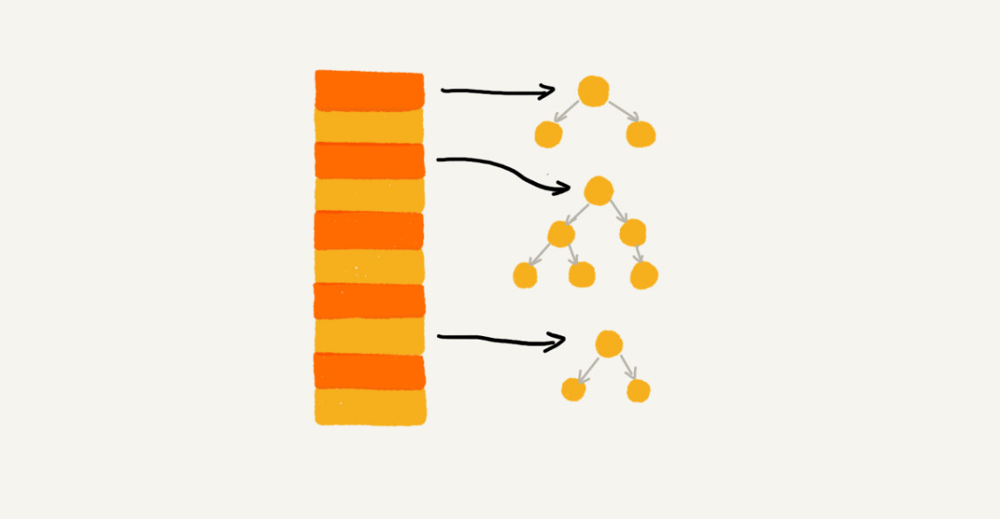
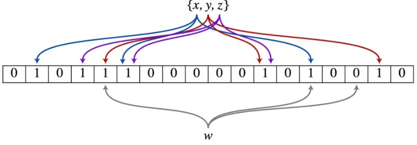

# 哈希

## 哈希映射

散列表用的是数组支持按照下标随机访问数据的特性，所以散列表其实就是数组的一种扩展，由数组演化而来。包括键，值和通过散列函数计算出来的散列值。


### 散列函数

#### 要求

+ 散列值是一个非负整数

+ 如果 key1 = key2，那 hash(key1) == hash(key2)
+ 如果 key1 ≠ key2，那 hash(key1) ≠ hash(key2)。

第三点无法完全避免，这就是散列冲突

#### 性能

+ 散列函数的设计不能太复杂。过于复杂的散列函数，势必会消耗计算时间，也就间接地影响到散列表的性能。
+ 散列函数生成的值要尽可能随机并且均匀分布，这样才


### 散列冲突

#### 装载因子

**散列表的装载因子=填入表中的元素个数/散列表的长度**

装载因子越大，说明空闲位置越少，冲突越多，散列表的性能会下降。针对散列表，当装载因子过大时，我们也可以进行动态扩容，重新申请一个更大的散列表，将数据搬移到这个新散列表中。


#### 动态扩容

为了解决一次性扩容耗时过多的情况，我们可以将扩容操作穿插在插入操作的过程中，分批完成。当装载因子触达阈值之后，我们只申请新空间，但并不将老的数据搬移到新散列表中。

+ 当有新数据要插入时，我们将新数据插入新散列表中，并且从老的散列表中拿出一个数据放入到新散列表。
+ 每次插入一个数据到散列表，我们都重复上面的过程。经过多次插入操作之后，老的散列表中的数据就一点一点全部搬移到新散列表中了。


#### 开放寻址法

散列表中的数据都存储在数组中，可以有效地利用 CPU 缓存加快查询速度而且利于序列化。**当数据量比较小、装载因子小的时候，适合采用开放寻址法，这样散列冲突的代价较小。**

##### 线性探测


+ 插入：如果某个数据经过散列函数散列之后，存储位置已经被占用了，就从当前位置开始，依次往后查找，看是否有空闲位置，直到找到为止
+ 删除：标记为 deleted。当线性探测查找的时候，遇到标记为 deleted 的空间，并不是停下来，而是继续往下探测

##### 二次探测

二次探测的步长就变成了原来的“二次方”，它探测的下标序列就是 hash(key)+0，hash(key)+12，hash(key)+22


#### 链表法

在散列表中，每个“桶（bucket）”或者“槽（slot）”会对应一条链表，所有散列值相同的元素我们都放到相同槽位对应的链表中。**只要散列函数的值随机均匀，即便装载因子变成 10**，也就是链表的长度变长了而已，虽然查找效率有所下降，但是比起顺序查找还是快很多。


链表法稍加改造，可以实现一个更加高效的散列表。比如跳表、红黑树。这样，即便出现散列冲突，极端情况下，所有的数据都散列到同一个桶内，那最终退化成的散列表的查找时间也只不过是 O(logn)。这样也就有效避免了前面讲到的散列碰撞攻击。




### 应用

#### LRU 缓存淘汰算法

一个缓存（cache）系统主要包含下面这几个操作

+ 往缓存中添加一个数据
+ 从缓存中删除一个数据
+ 在缓存中查找一个数据。

如果单纯地采用链表的话，时间复杂度只能是 O(n)。如果我们将散列表和链表两种数据结构组合使用，可以将这三个操作的时间复杂度都降低到 O(1)。具体的结构就是下面这个样子


#### LinkedHashMap

LinkedHashMap 是通过双向链表和散列表这两种数据结构组合实现的。LinkedHashMap 中的“Linked”实际上是指的是**双向链表**，并非指用链表法解决散列冲突。


#### 布隆过滤器 BloomFilter

布隆过滤器可以**近乎准确地快速判断一个元素是否在集合里面**，核心实现是一个超大的位数组和几个哈希函数。**假设位数组的长度为m，哈希函数的个数为k**。假设集合里面有3个元素{x, y, z}，哈希函数的个数为3。首先将位数组进行初始化，将里面每个位都设置位0。

**插入**：对于集合里面的每一个元素，**将元素依次通过k个哈希函数进行映射，每次映射都会产生一个哈希值，这个值对应位数组上面的一个点**，然后将位数组对应的位置标记为1。

**查询**：W元素是否存在集合中的时候，同样的方法将W通过哈希映射到位数组上的k个点。

+ 如果k个点的其中有一个点不为1，则可以判断该元素一定不存在集合中。

+ 如果k个点都为1，则该元素可能存在集合中。




## 哈希算法

### 概述

哈希算法的定义和原理非常简单，基本上一句话就可以概括了。将任意长度的二进制值串映射为固定长度的二进制值串，这个映射的规则就是哈希算法，而通过原始数据映射之后得到的二进制值串就是哈希值。

+ 从哈希值不能反向推导出原始数据（所以哈希算法也叫单向哈希算法）
+ 对输入数据非常敏感，哪怕原始数据只修改了一个 Bit，最后得到的哈希值也大不相同
+ 散列冲突的概率要很小，对于不同的原始数据，哈希值相同的概率非常小
+ 哈希算法的执行效率要尽量高效，针对较长的文本，也能快速地计算出哈希值。

### 应用

#### 安全加密

MD5（MD5 Message-Digest Algorithm，MD5 消息摘要算法）

SHA（Secure Hash Algorithm，安全散列算法）

DES（Data Encryption Standard，数据加密标准）

AES（Advanced Encryption Standard，高级加密标准）

#### 唯一标识

从图片的二进制码串开头取 100 个字节，从中间取 100 个字节，从最后再取 100 个字节，然后将这 300 个字节放到一块，通过哈希算法（比如 MD5），得到一个哈希字符串，用它作为图片的唯一标识。

#### 数据校验

BT 下载软件文件， 对 100 个文件块分别取哈希值，并且保存在种子文件中。文件块下载完成之后，我们可以通过相同的哈希算法，对下载好的文件块逐一求哈希值，然后跟种子文件中保存的哈希值比对。

#### 散列函数

散列函数也是哈希算法的一种应用。列函数对于散列算法计算得到的值，是否能反向解密也并不关心。散列函数中用到的散列算法，更加关注散列后的值是否能平均分布。

#### 负载均衡

实现一个会话粘滞（session sticky）的负载均衡算法。可以通过哈希算法，对客户端 IP 地址或者会话 ID 计算哈希值，将取得的哈希值与服务器列表的大小进行取模运算，最终得到的值就是应该被路由到的服务器编号。

#### 数据分片

先对数据进行分片，然后采用多台机器处理的方法，来提高处理速度。这里的处理过程也是 MapReduce 的基本设计思想。

#### 分布式存储

数据分片的思想，即通过哈希算法对数据取哈希值，然后对机器个数取模，这个最终值就是应该存储的缓存机器编号。但是，如果数据增多，原来的 10 个机器已经无法承受了，我们就需要扩容了。**所有的数据都要重新计算哈希值，然后重新搬移到正确的机器上。这样就相当于，缓存中的数据一下子就都失效了。**所有的数据请求都会穿透缓存，直接去请求数据库。这样就可能发生**雪崩效应**，压垮数据库。

假设有 k 个机器，数据的哈希值的范围是[0, MAX]。我们将整个范围划分成 m 个小区间（m 远大于 k），每个机器负责 m/k 个小区间。当有新机器加入的时候，我们就将某几个小区间的数据，从原来的机器中搬移到新的机器中


## 习题
| 序号 | 题目                                                         | 次数 |
| ---- | ------------------------------------------------------------ | ---- |
| 380  | [常数时间插入、删除和获取随机元素](https://leetcode-cn.com/problems/insert-delete-getrandom-o1/) | 1    |
| 242  | [有效的字母异位词](https://leetcode-cn.com/problems/valid-anagram/) | 2    |
| 49   | [字母异位词分组](https://leetcode-cn.com/problems/group-anagrams/) | 2    |
| 249  | [移位字符串分组](https://leetcode-cn.com/problems/group-shifted-strings/) | 2    |
| 202  | [快乐数](https://leetcode-cn.com/problems/happy-number/)     | 1    |
| 1    | [两数之和](https://leetcode-cn.com/problems/two-sum/)        | 2    |
| 454  | [四数相加 II](https://leetcode-cn.com/problems/4sum-ii/)     | 1    |
| 424  | [替换后的最长重复字符](https://leetcode-cn.com/problems/longest-repeating-character-replacement/) | 1    |
| 159  | [至多包含两个不同字符的最长子串](https://leetcode-cn.com/problems/longest-substring-with-at-most-two-distinct-characters/) | 2    |

### 有效异位词

异位词 = 相同字符串的排列

+ 排序
+ 哈希映射记录每个字符的次数

```JAVA
class Solution {
    public boolean isAnagram(String s, String t) {

        if (s == null && t == null) return true;

        if (s.length() != t.length()) return false;
        
        Map<Character, Integer> map1 = new HashMap<>();
        for(Character c: s.toCharArray()) {
            putIntoMap(map1, c);
        }

        Map<Character, Integer> map2 = new HashMap<>();
        for(Character c: t.toCharArray()) {
            putIntoMap(map2, c);
        }


        for(Character c: map1.keySet()) {
            if (!map1.get(c).equals(map2.get(c))) return false;
        }

        return true;
    }

    public static void putIntoMap(Map<Character, Integer> map, Character c) {

        if (map.containsKey(c)) {
            map.put(c, map.get(c) + 1);
        } else {
            map.put(c, 1);
        }
    }
}
```


### 字母异位词分组

利用异位词分组是异位词排序以后字符串相投

```java
class Solution {
    public List<List<String>> groupAnagrams(String[] strs) {

        Map<String, List<String>> map = new HashMap<>();
        List<List<String>> result = new LinkedList<>();

        for(int i = 0; i < strs.length; i++) {
            String str = strs[i];
            char[] chars = str.toCharArray();
            Arrays.sort(chars);
            String sorted = new String(chars);
        
            if (!map.containsKey(sorted)) {
                map.put(sorted, new ArrayList<String>());
            }
            map.get(sorted).add(str);
        }


        for(String key: map.keySet()) {
            result.add(map.get(key));
        }
        return result;
    }
}
```


### 两数之和

```JAVA
class Solution {
    public int[] twoSum(int[] nums, int target) {
        
        Map<Integer, Integer> map = new HashMap<>();
        for(int i = 0; i < nums.length; i++) {
            
            int rest = target - nums[i];
            if (map.containsKey(rest)) {
                return new int[]{map.get(rest), i};
            } else {
                map.put(nums[i], i);
            }
        }
        return new int[2];
    }
}
```
