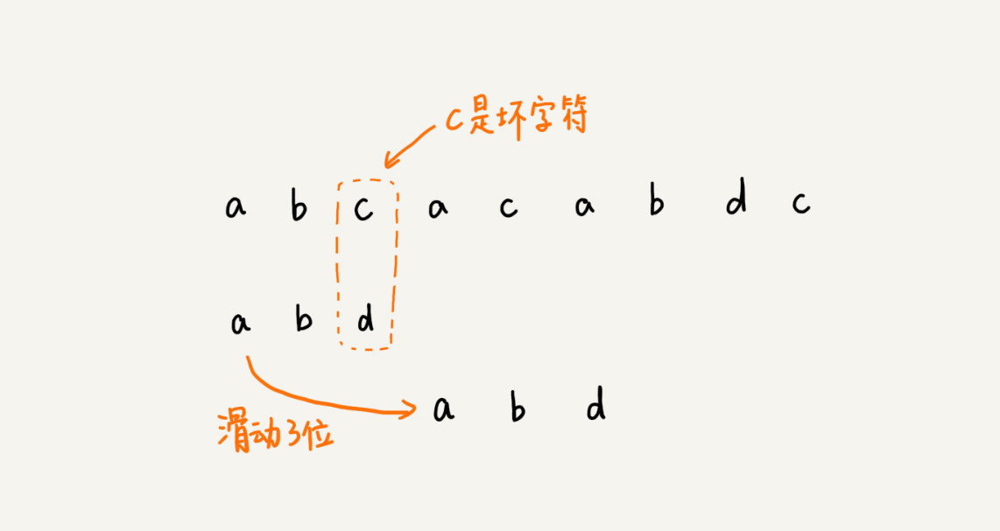

# 排序

| 序号 | 题目次数                                                     | 次数 |
| ---- | ------------------------------------------------------------ | ---- |
| 1122 | [数组的相对排序](https://leetcode-cn.com/problems/relative-sort-array/) | 1    |
| 242  | [有效的字母异位词](https://leetcode-cn.com/problems/valid-anagram/) | 2    |
| 56   | [合并区间](https://leetcode-cn.com/problems/merge-intervals/) | 1    |
| 1244 | [力扣排行榜](https://leetcode-cn.com/problems/design-a-leaderboard/) | 1    |
| 493  | [ 翻转对](https://leetcode-cn.com/problems/reverse-pairs/)   |      |
|      |                                                              |      |
|      |                                                              |      |


## 概述

### 暴力算法

在主串中，检查起始位置分别是 0、1、2…n-m 且长度为 m 的 n-m+1 个子串，看有没有跟模式串匹配的


### Rabin-Karp 算法

通过哈希算法对主串中的 n-m+1 个子串分别求哈希值，然后逐个与模式串的哈希值比较大小。

+ 如果哈希值不相等，就说明肯定不匹配
+ 如果某个子串的哈希值与模式串相等，那就说明对应的子串和模式串匹配了


```Java
public static int rabinKarpSerach(String txt, String pat) {
  int M = pat.length();
  int N = txt.length();
  int i, j;
  int patHash = 0, txtHash = 0;

  for (i = 0; i < M; i++) {
    patHash = (D * patHash + pat.charAt(i)) % Q;
    txtHash = (D * txtHash + txt.charAt(i)) % Q;
  }
  
  int highestPow = 1;  // pow(256, M-1)
  for (i = 0; i < M - 1; i++)
    highestPow = (highestPow * D) % Q;

  for (i = 0; i <= N - M; i++) { // 枚举起点
    if (patHash == txtHash) {
      for (j = 0; j < M; j++) {
        if (txt.charAt(i + j) != pat.charAt(j))
          break;
      }
      if (j == M)
        return i;
    }
    if (i < N - M) {
      txtHash = (D * (txtHash - txt.charAt(i) * highestPow) + txt.charAt(i + M)) % Q;
      if (txtHash < 0)
        txtHash += Q;
    }
  }
  return -1;
}
```


### Boyer-Moore 算法

BM 算法包含两部分，分别是坏字符规则（bad character rule）和好后缀规则（good suffix shift）

#### 坏字符规则

按照模式串下标从大到小的顺序，倒着匹配的。发现某个字符没法匹配的时候。把这个没有匹配的字符叫作坏字符（主串中的字符）




当发生不匹配的时候，我们把坏字符对应的模式串中的字符下标记作 si。

+ 如果坏字符在模式串中存在，我们把这个坏字符在模式串中的下标记作 xi。
+ 如果不存在，我们把 xi 记作 -1。

**那模式串往后移动的位数就等于 si-xi。**


#### 好后缀规则

把已经匹配的 bc 叫作好后缀，记作{u}。拿它在模式串中查找，如果找到了另一个跟{u}相匹配的子串{u'}，那我们就将模式串滑动到子串{u'}与主串中{u}对齐的位置。


当模式串滑动到前缀与主串中{u}的后缀有部分重合的时候，并且重合的部分相等的时候，就有可能会存在完全匹配的情况。


+ 好后缀在模式串中，是否有另一个匹配的子串，
+ 好后缀的后缀子串，是否存在跟模式串的前缀子串匹配的

```JAVA
    private static final int SIZE = 256; // 全局变量或成员变量
    private void generateBC(char[] b, int m, int[] bc) {
        for (int i = 0; i < SIZE; ++i) {
            bc[i] = -1; // 初始化bc
        }
        for (int i = 0; i < m; ++i) {
            int ascii = (int)b[i]; // 计算b[i]的ASCII值
            bc[ascii] = i;
        }
    }

    // a,b表示主串和模式串；n，m表示主串和模式串的长度。
    public int bm(char[] a, int n, char[] b, int m) {
        int[] bc = new int[256]; // 记录模式串中每个字符最后出现的位置
        generateBC(b, m, bc); // 构建坏字符哈希表
        int[] suffix = new int[m];
        boolean[] prefix = new boolean[m];
        generateGS(b, m, suffix, prefix);
        int i = 0; // j表示主串与模式串匹配的第一个字符
        while (i <= n - m) {
            int j;
            for (j = m - 1; j >= 0; --j) { // 模式串从后往前匹配
                if (a[i+j] != b[j]) break; // 坏字符对应模式串中的下标是j
            }
            if (j < 0) {
                return i; // 匹配成功，返回主串与模式串第一个匹配的字符的位置
            }
            int x = j - bc[(int)a[i+j]];
            int y = 0;
            if (j < m-1) { // 如果有好后缀的话
                y = moveByGS(j, m, suffix, prefix);
            }
            i = i + Math.max(x, y);
        }
        return -1;
    }

    // j表示坏字符对应的模式串中的字符下标; m表示模式串长度
    private int moveByGS(int j, int m, int[] suffix, boolean[] prefix) {
        int k = m - 1 - j; // 好后缀长度
        if (suffix[k] != -1) return j - suffix[k] +1;
      	// j表示坏字符对应的模式串中的字符下标;
      	// j + 1表示好后缀的下标;
        for (int r = j+2; r <= m-1; ++r) {
            if (prefix[m-r] == true) {
                return r;
            }
        }
        return m;
    }

    private void generateGS(char[] b, int m, int[] suffix, boolean[] prefix) {
        for (int i = 0; i < m; ++i) { // 初始化
            suffix[i] = -1;
            prefix[i] = false;
        }

        for (int i = 0; i < m - 1; ++i) { // b[0, i]
             int j = i;
             int k = 0; // 公共后缀子串长度
             while (j >= 0 && b[j] == b[m-1-k]) { // 与b[0, m-1]求公共后缀子串
                  --j;
                  ++k;
                  suffix[k] = j+1; //j+1表示公共后缀子串在b[0, i]中的起始下标
             }

             if (j == -1) prefix[k] = true; //如果公共后缀子串也是模式串的前缀子串
        }
    }
```

