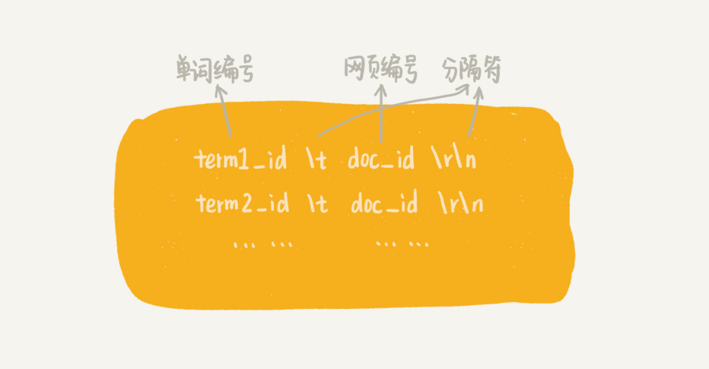
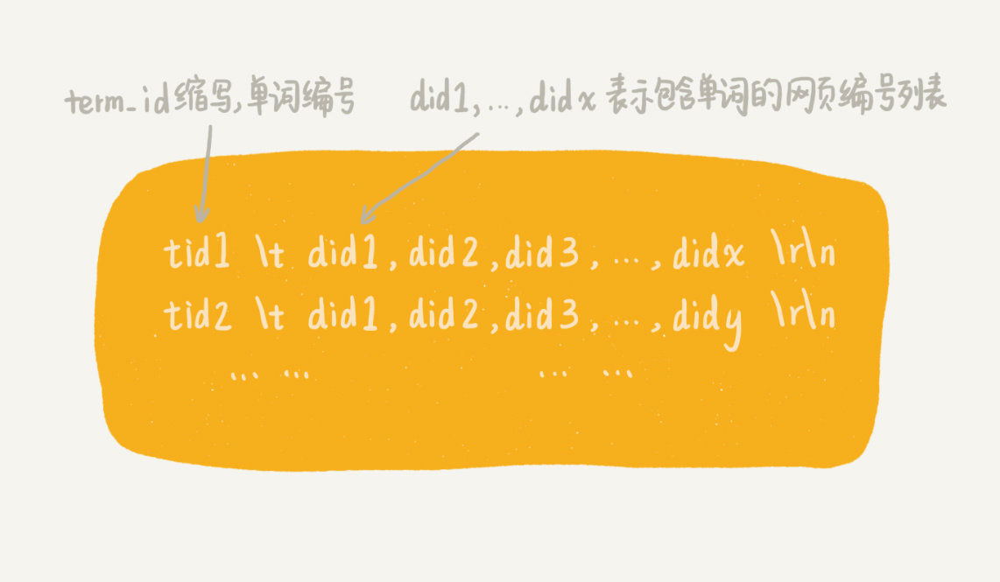
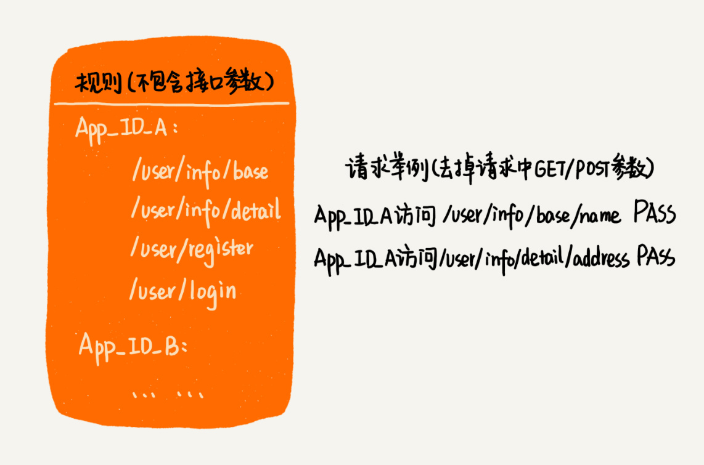
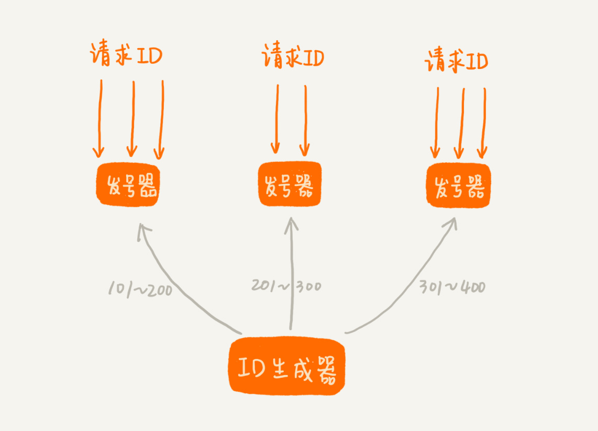
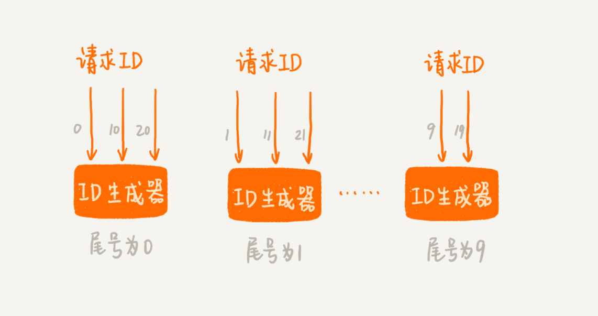

# 实践

## 1. Redis集合

### 列表（list）

#### 压缩列表

当列表中存储的数据量比较小的时候，列表就可以采用压缩列表的方式实现。具体需要同时满足下面两个条件

+ 列表中保存的单个数据（有可能是字符串类型的）小于 64 字节
+ 列表中数据个数少于 512 个


压缩列表这种存储结构，一方面比较节省内存，另一方面可以支持不同类型数据的存储。

#### 双向链表

```C
typedef struct listnode {
  struct listNode *prev;
  struct listNode *next;
  void *value;
} listNode;


typedef struct list {
  listNode *head;
  listNode *tail;
  unsigned long len;
  // ....省略其他定义
} list;
```


### 字典（hash）

#### 压缩列表

只有当存储的数据量比较小的情况下，Redis 才使用压缩列表来实现字典类型。具体需要满足两个条件

+ 字典中保存的键和值的大小都要小于 64 字节
+ 字典中键值对的个数要小于 512 个。

#### 散列表

当数据动态增加之后，散列表的装载因子会不停地变大。为了避免散列表性能的下降，当装载因子大于 1 的时候，Redis 会触发扩容，将散列表扩大为原来大小的 2 倍左右

当数据动态减少之后，为了节省内存，当装载因子小于 0.1 的时候，Redis 就会触发缩容，缩小为字典中数据个数的大约 2 倍大小


### 集合（set）

#### 有序数组

Redis 就采用有序数组，来实现集合这种数据类型

+ 存储的数据都是整数
+ 存储的数据元素个数不超过 512 个。

#### 散列表


### 有序集合（sortedset）

#### 有序数组

Redis 就采用有序数组，来实现集合这种数据类型

+ 所有数据的大小都要小于 64 字节
+ 元素个数要小于 128 个

#### 跳表

存储一组数据，并且每个数据会附带一个得分。通过得分的大小，我们将数据组织成跳表这样的数据结构，以支持快速地按照得分值、得分区间获取数据。


### 持久化

#### 只存储数据

**第一种是清除原有的存储结构，只将数据存储到磁盘中。**当我们需要从磁盘还原数据到内存的时候，再重新将数据组织成原来的数据结构。实际上，Redis 采用的就是这种持久化思路。

这种方式也有一定的弊端。**那就是数据从硬盘还原到内存的过程，会耗用比较多的时间。**


#### 存储数据和结构

保留原来的存储格式，将数据按照原有的格式存储在磁盘中。我们拿散列表这样的数据结构来举例。我们可以将散列表的大小、每个数据被散列到的槽的编号等信息，都保存在磁盘中。有了这些信息，**我们从磁盘中将数据还原到内存中的时候，就可以避免重新计算哈希值。**


## 2. 搜索引擎

### 搜集

#### 待爬取网页链接文件：links.bin

在广度优先搜索爬取页面的过程中，爬虫会不停地解析页面链接，将其放到队列中。

#### 网页判重文件：bloom_filter.bin

使用布隆过滤器，我们就可以快速并且非常节省内存地实现网页的判重。

#### 原始网页存储文件：doc_raw.bin

如果我们把每个网页都存储为一个独立的文件，那磁盘中的文件就会非常多，数量可能会有几千万，甚至上亿。常用的文件系统显然不适合存储如此多的文件。**所以，我们可以把多个网页存储在一个文件中。**


#### 网页链接及其编号的对应文件：doc_id.bin

我们维护一个中心的计数器，每爬取到一个网页之后，就从计数器中拿一个号码，分配给这个网页，然后计数器加一。在存储网页的同时，**我们将网页链接跟编号之间的对应关系，存储在另一个 doc_id.bin 文件中**

### 分析

#### 抽取网页文本信息

利用 AC 自动机这种多模式串匹配算法，在网页这个大字符串中，一次性查找<stlye>, <scripti>,<option> 关键字，并向后遍历把标签删除。

#### 分词并创建临时索引

字典也叫词库，里面包含大量常用的词语。我们借助词库并采用最长匹配规则，来对文本进行分词。所谓最长匹配，也就是匹配尽可能长的词语。

每个网页的文本信息在分词完成之后，我们都得到一组单词列表。我们把单词与网页之间的对应关系，写入到一个临时索引文件中（tmp_Index.bin），这个临时索引文件用来构建倒排索引文件。临时索引文件的格式如下：



给单词编号的方式，跟给网页编号类似。我们维护一个计数器，每当从网页文本信息中分割出一个新的单词的时候，我们就从计数器中取一个编号，分配给它，然后计数器加一。

当所有的网页处理（分词及写入临时索引）完成之后，我们再将这个单词跟编号之间的对应关系，写入到磁盘文件中，并命名为 **term_id.bin。**

经过分析阶段，我们得到了两个重要的文件。它们分别是**临时索引文件（tmp_index.bin）**和**单词编号文件（term_id.bin）。**

### 索引

索引阶段主要负责将分析阶段产生的临时索引，构建成倒排索引。倒排索引（ Inverted index）中记录了每个单词以及包含它的网页列表。



并排序的处理思想，将其分割成多个小文件，先对每个小文件独立排序，最后再合并在一起。当然，实际的软件开发中，我们其实可以直接利用 MapReduce 来处理。


除了倒排文件之外，我们还需要一个文件，**来记录每个单词编号在倒排索引文件中的偏移位置。我们把这个文件命名为 term_offset.bin。**


### 查询

前面三个阶段的处理，只是为了最后的查询做铺垫。因此，现在我们就要利用之前产生的几个文件，来实现最终的用户搜索功能。

+ doc_id.bin：记录网页链接和编号之间的对应关系。
+ term_id.bin：记录单词和编号之间的对应关系。
+ term_offsert.bin：记录每个单词编号在倒排索引文件中的偏移位置。
+ index.bin：倒排索引文件，记录每个单词编号以及对应包含它的网页编号列表。

查找顺序

+ 我们拿这 k 个单词，去 term_id.bin 对应的散列表中，查找对应的单词编号。经过这个查询之后，我们得到了这 k 个单词对应的单词编号。

+ 我们拿这 k 个单词编号，去 term_offset.bin 对应的散列表中，查找每个单词编号在倒排索引文件中的偏移位置。经过这个查询之后，我们得到了 k 个偏移位置。
+ 我们拿这 k 个偏移位置，去倒排索引（index.bin）中，查找 k 个单词对应的包含它的网页编号列表。经过这一步查询之后，我们得到了 k 个网页编号列表。


## 3. Disruptor

Disruptor 是线程之间用于消息传递的队列

### 循环列表实现生产者 - 消费者

```JAVA
public class Queue {
  private Long[] data;
  private int size = 0, head = 0, tail = 0;
  public Queue(int size) {
    this.data = new Long[size];
    this.size = size;
  }

  public boolean add(Long element) {
    if ((tail + 1) % size == head) return false;
    data[tail] = element;
    tail = (tail + 1) % size;
    return true;
  }

  public Long poll() {
    if (head == tail) return null;
    long ret = data[head];
    head = (head + 1) % size;
    return ret;
  }
}

public class Producer {
  private Queue queue;
  public Producer(Queue queue) {
    this.queue = queue;
  }

  public void produce(Long data) throws InterruptedException {
    while (!queue.add(data)) {
      Thread.sleep(100);
    }
  }
}

public class Consumer {
  private Queue queue;
  public Consumer(Queue queue) {
    this.queue = queue;
  }

  public void comsume() throws InterruptedException {
    while (true) {
      Long data = queue.poll();
      if (data == null) {
        Thread.sleep(100);
      } else {
        // TODO:...消费数据的业务逻辑...
      }
    }
  }
}
```

### 加锁的并发“生产者 - 消费者模型

在多个生产者或者多个消费者并发操作队列的情况下，刚刚的代码主要会有下面两个问题：

+ 多个生产者写入的数据可能会互相覆盖
+ 多个消费者可能会读取重复的数据。


```JAVA
public boolean add(Long element) {
  if ((tail + 1) % size == head) return false;
  data[tail] = element;
  tail = (tail + 1) % size;
  return true;
}
```

从这段代码中，我们可以看到，第 3 行给 data[tail]赋值，然后第 4 行才给 tail 的值加一。赋值和 tail 加一两个操作，并非原子操作。这就会导致这样的情况发生：当线程 1 和线程 2 同时执行 add() 函数的时候，线程 1 先执行完了第 3 行语句，将 data[7]（tail 等于 7）的值设置为 12。在线程 1 还未执行到第 4 行语句之前，也就是还未将 tail 加一之前，线程 2 执行了第 3 行语句，又将 data[7]的值设置为 15，也就是说，那线程 2 插入的数据覆盖了线程 1 插入的数据。原本应该插入两个数据（12 和 15）的，现在只插入了一个数据（15）。


最简单的处理方法就是给这段代码加锁，同一时间只允许一个线程执行 add() 函数。这就相当于将这段代码的执行，由并行改成了串行，也就不存在我们刚刚说的问题了。


### 无锁的并发“生产者 - 消费者模型

生产者来说，它往队列中添加数据之前，先申请可用空闲存储单元，并且是批量地申请连续的 n 个（n≥1）存储单元。当申请到这组连续的存储单元之后，后续往队列中添加元素，就可以不用加锁了，**因为这组存储单元是这个线程独享的。申请存储单元的过程是需要加锁的。**

对于消费者来说，处理的过程跟生产者是类似的。它先去申请一批连续可读的存储单元，**当申请到这批存储单元之后，后续的读取操作就可以不用加锁了。**


## 4. 微服务鉴权和限流

### 鉴权

#### 精确匹配规则

将每个应用对应的权限规则，存储在一个字符串数组中。当用户请求到来时，我们拿用户的请求 URL，在这个字符串数组中逐一匹配，**匹配的算法就是我们之前学过的字符串匹配算法**

可以按照字符串的大小给规则排序，把它组织成有序数组这种数据结构。当要查找某个 URL 能否匹配其中某条规则的时候，**我们可以采用二分查找算法，在有序数组中进行匹配。**


#### 前缀匹配规则

Trie 树中的每个节点不是存储单个字符，而是存储接口被“/”分割之后的子目录（比如“/user/name”被分割为“user”“name”两个子目录）。




#### 模糊匹配规则

把不包含通配符的规则，组织成有序数组或者 Trie 树

剩下的是少数包含通配符的规则，**我们只要把它们简单存储在一个数组中就可以了。尽管匹配起来会比较慢，但是毕竟这种规则比较少，所以这种方法也是可以接受的。**


### 限流

#### 固定时间窗口限流

首先我们需要选定一个时间起点，之后每当有接口请求到来，我们就将计数器加一。如果在当前时间窗口内，根据限流规则（比如每秒钟最大允许 100 次访问请求），出现累加访问次数超过限流值的情况时，我们就拒绝后续的访问请求。当进入下一个时间窗口之后，计数器就清零重新计数。


假设我们的限流规则是，每秒钟不能超过 100 次接口请求。第一个 1s 时间窗口内，100 次接口请求都集中在最后 10ms 内。在第二个 1s 的时间窗口内，100 次接口请求都集中在最开始的 10ms 内。虽然两个时间窗口内流量都符合限流要求（≤100 个请求），**但在两个时间窗口临界的 20ms 内，会集中有 200 次接口请求。固定时间窗口限流算法并不能对这种情况做限制，所以，集中在这 20ms 内的 200 次请求就有可能压垮系统。**


#### 滑动时间窗口限流

我们假设限流的规则是，在任意 1s 内，接口的请求次数都不能大于 K 次。我们就维护一个大小为 K+1 的循环队列，用来记录 1s 内到来的请求。注意，这里循环队列的大小等于限流次数加一，因为循环队列存储数据时会浪费一个存储单元。


## 5. 短网址服务

短网址服务的一个核心功能，就是把原始的长网址转化成短网址。除了这个功能之外，短网址服务还有另外一个必不可少的功能。那就是，当用户点击短网址的时候，短网址服务会将浏览器重定向为原始网址。


### 哈希算法

#### 短网址生成

MurmurHash 哈希算法在 2008 年才被发明出来，但现在它已经广泛应用到 Redis、MemCache、Cassandra、HBase、Lucene 等众多著名的软件中。

对于开头那个 GitHub 网址，经过 MurmurHash 计算后，得到的哈希值就是 181338494。我们再拼上短网址服务的域名，就变成了最终的短网址 http://t.cn/181338494

在网址 URL 中，常用的合法字符有 0～9、a～z、A～Z 这样 62 个字符。为了让哈希值表示起来尽可能短，可以**将 10 进制的哈希值转化成 62 进制。**


#### 哈希冲突

当有一个新的原始网址需要生成短网址的时候，我们先利用 MurmurHash 算法，生成短网址。然后，我们拿这个新生成的短网址，在 MySQL 数据库中查找。

如果没有找到相同的短网址，这也就表明，这个新生成的短网址没有冲突。于是我们就将这个短网址返回给用户（请求生成短网址的用户），然后将这个短网址与原始网址之间的对应关系，存储到 MySQL 数据库中。

。如果数据库中记录的原始网址，跟我们正在处理的原始网址不一样，那就说明哈希算法发生了冲突。不同的原始网址，经过计算，得到的短网址重复了。**我们可以给原始网址拼接一串特殊字符，比如“[DUPLICATED]”，然后再重新计算哈希值，两次哈希计算都冲突的概率，显然是非常低的**

#### 提高查询性能

我们可以给短网址字段添加 B+ 树索引。这样通过短网址查询原始网址的速度就提高了很多。

### ID生成

维护一个 ID 自增生成器。它可以生成 1、2、3…这样自增的整数 ID。当短网址服务接收到一个原始网址转化成短网址的请求之后，它先从 ID 生成器中取一个号码，然后将其转化成 62 进制表示法，拼接到短网址服务的域名（比如http://t.cn/）后面，就形成了最终的短网址。

#### 相同的原始网址可能会对应不同的短网址

每次新来一个原始网址，我们就生成一个新的短网址，这种做法就会导致两个相同的原始网址生成了不同的短网址

**第一种处理思路是不做处理。**实际上，相同的原始网址对应不同的短网址，这个用户是可以接受的。

**第二种处理思路是借助哈希算法生成短网址的处理思想**，当要给一个原始网址生成短网址的时候，我们要先拿原始网址在数据库中查找，看数据库中是否已经存在相同的原始网址了。如果数据库中存在，那我们就取出对应的短网址，直接返回给用户。

#### 高性能的 ID 生成器

#### 前置发号器

第一种思路是借助第 54 节中讲的方法。我们可以给 ID 生成器装多个前置发号器。我们批量地给每个前置发号器发送 ID 号码。当我们接受到短网址生成请求的时候，就选择一个前置发号器来取号码。这样通过多个前置发号器，明显提高了并发发号的能力。



#### 多个ID生成器

