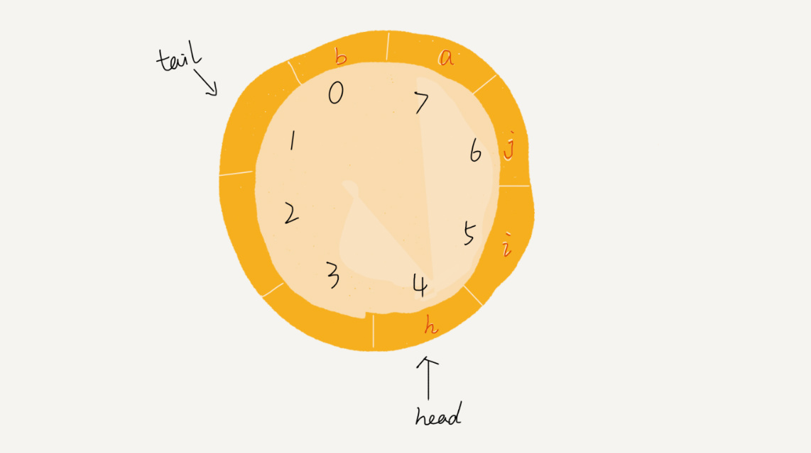

# 队列

## 概述

队列也是一种操作受限的线性表数据结构。

+ 用数组实现的队列，叫作**顺序队列**
+ 用链表实现的队列，叫作**链式队列**


## 实现

### 循环队列

循环队列，顾名思义，它长得像一个环。原本数组是有头有尾的，是一条直线。现在我们把首尾相连，扳成了一个环。


队列的大小为 8，当前 head=4，tail=7。当有一个新的元素 a 入队时，我们放入下标为 7 的位置。但这个时候，我们并不把 tail 更新为 8，而是将其在环中后移一位，到下标为 0 的位置。当再有一个元素 b 入队时，我们将 b 放入下标为 0 的位置，然后 tail 加 1 更新为 1。



确定好队空和队满的判定条件

+ 队列为空的判断条件是 head == tail
+ **队列满的判断条件是 (tail+1)%n=head**

```java
public class CircularQueue {
  // 数组：items，数组大小：n
  private String[] items;
  private int n = 0;
  // head表示队头下标，tail表示队尾下标
  private int head = 0;
  private int tail = 0;

  // 申请一个大小为capacity的数组
  public CircularQueue(int capacity) {
    items = new String[capacity];
    n = capacity;
  }

  // 入队
  public boolean enqueue(String item) {
    // 队列满了
    if ((tail + 1) % n == head) return false;
    items[tail] = item;
    tail = (tail + 1) % n;
    return true;
  }

  // 出队
  public String dequeue() {
    // 如果head == tail 表示队列为空
    if (head == tail) return null;
    String ret = items[head];
    head = (head + 1) % n;
    return ret;
  }
}
```

### 阻塞队列

阻塞队列其实就是在队列基础上增加了阻塞操作。简单来说，就是在队列为空的时候，从队头取数据会被阻塞。因为此时还没有数据可取，直到队列中有了数据才能返回；如果队列已经满了，那么插入数据的操作就会被阻塞，直到队列中有空闲位置后再插入数据，然后再返回。


### 并发队列

并发队列。最简单直接的实现方式是直接在 enqueue()、dequeue() 方法上加锁，但是锁粒度大并发度会比较低，同一时刻仅允许一个存或者取操作。


## 习题

| 序号 | 题目                                                         | 连接 |
| ---- | ------------------------------------------------------------ | ---- |
| 641  | [设计循环双端队列](https://leetcode-cn.com/problems/design-circular-deque/) | 3    |
| 346  | [数据流中的移动平均值](https://leetcode-cn.com/problems/moving-average-from-data-stream/) | 2    |
| 239  | [滑动窗口最大值](https://leetcode-cn.com/problems/sliding-window-maximum/) | 2    |


### 双端队列在Array中设计

- Head 是头节点
- Tail 是尾节点的下一个节点
- 通过 Head == Tail 来判断当前链条是否是空，(Tail + 1) % Capactiy == Head 来判断是否链表已满
- 往前移动 (index + 1) % capactiy
- 往后移动 (index + 1 + capacity) % capacity

```java
class MyCircularDeque {

    /** Initialize your data structure here. Set the size of the deque to be k. */
    int[] arr;
    int head, tail;
    public MyCircularDeque(int k) {
        arr = new int[k + 1];
        head = 0;
        tail = 0;
    }
    
    /** Adds an item at the front of Deque. Return true if the operation is successful. */
    public boolean insertFront(int value) {
        if (isFull()) return false;
        arr[(head - 1 + arr.length) % arr.length] = value;
        head = (head - 1 + arr.length) % arr.length;
        return true;
    }
    
    /** Adds an item at the rear of Deque. Return true if the operation is successful. */
    public boolean insertLast(int value) {
        if (isFull()) return false;
        arr[tail] = value;
        tail = (tail + 1) % arr.length;
        return true;
    }
    
    /** Deletes an item from the front of Deque. Return true if the operation is successful. */
    public boolean deleteFront() {
        if (isEmpty()) return false;
        head = (head + 1) % arr.length;
        return true;
    }
    
    /** Deletes an item from the rear of Deque. Return true if the operation is successful. */
    public boolean deleteLast() {
        if (isEmpty()) return false;
        tail = (tail - 1 + arr.length) % arr.length;
        return true;
    }
    
    /** Get the front item from the deque. */
    public int getFront() {
        if (isEmpty()) return -1;
        return arr[head];
    }
    
    /** Get the last item from the deque. */
    public int getRear() {
        if (isEmpty()) return -1;
        return arr[(tail - 1 + arr.length) % arr.length];
    }
    
    /** Checks whether the circular deque is empty or not. */
    public boolean isEmpty() {
        return tail == head;
    }
    
    /** Checks whether the circular deque is full or not. */
    public boolean isFull() {
        return (tail + 1) % arr.length == head;
    }
}
```


### 滑动窗口最大值

+ 确定滑动窗口在第几个元素可能溢出
+ 确定加入元素的条件
+ **单调递增还是单调递减**

```java
class Solution {
    public int[] maxSlidingWindow(int[] nums, int k) {
        
        if (nums.length < k - 1) return new int[]{};

        int[] ans = new int[nums.length - k + 1];
        Deque<Integer> q = new ArrayDeque<>();
        for(int i = 0; i < nums.length; i++) {

            if (i >= k && q.peek() == nums[i - k]) {
                q.removeFirst();
            }

            while(q.size() != 0 && q.getLast() < nums[i]) {
                q.removeLast();
            }
            q.addLast(nums[i]);
            if (i >= k - 1) {
                ans[i - k + 1] = q.getFirst();
            }
        }
        return ans;
    }
}	
```

