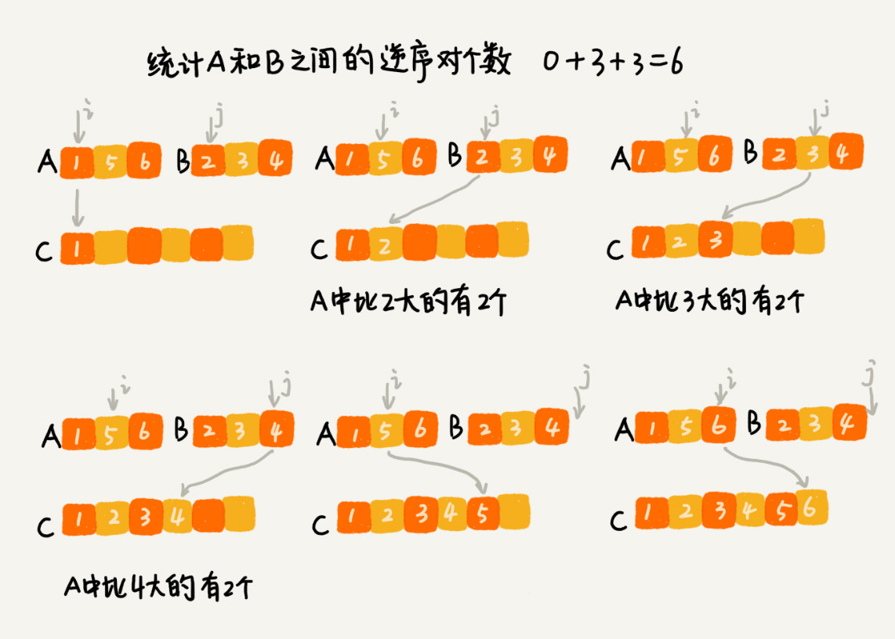

# 递归

## 概述

### 递归条件

+ 一个问题的解可以分解为几个子问题的解

+ 这个问题与分解之后的子问题，除了数据规模不同，求解思路完全一样
+ 存在递归终止条件


### 递归代码

#### 递归关键

写递归代码的关键

+ 找到如何将大问题分解为小问题的规律，并且基于此写出递推公式
+ 推敲终止条件，最后将递推公式和终止条件翻译成代码

**编写递归代码的关键是，只要遇到递归，我们就把它抽象成一个递推公式，不用想一层层的调用关系，不要试图用人脑去分解递归的每个步骤。**

#### 递归问题

##### 堆栈溢出

函数调用会使用栈来保存临时变量。每调用一个函数，都会将临时变量封装为栈帧压入内存栈，等函数执行完成返回时，才出栈。系统栈或者虚拟机栈空间一般都不大。如果递归求解的数据规模很大，调用层次很深，一直压入栈，就会有堆栈溢出的风险。

我们可以通过在代码中限制递归调用的最大深度的方式来解决这个问题。递归调用超过一定深度（比如 1000）之后，我们就不继续往下再递归了，直接返回报错。

```JAVA

// 全局变量，表示递归的深度。
int depth = 0;

int f(int n) {
  ++depth；
  if (depth > 1000) throw exception;
  
  if (n == 1) return 1;
  return f(n-1) + 1;
}
```

##### 重复计算


### 分治算法

分治算法（divide and conquer）的核心思想其实就是四个字，分而治之 ，也就是将原问题划分成 n 个规模较小，并且结构与原问题相似的子问题，递归地解决这些子问题，然后再合并其结果，就得到原问题的解。

**分治算法是一种处理问题的思想，递归是一种编程技巧。**

+ 分解：将原问题分解成一系列子问题
+ 解决：递归地求解各个子问题，若子问题足够小，则直接求解
+ 合并：将子问题的结果合并成原问题。

#### 逆序对

我们用分治算法来试试。我们套用分治的思想来求数组 A 的逆序对个数。我们可以将数组分成前后两半 A1 和 A2，分别计算 A1 和 A2 的逆序对个数 K1 和 K2，**然后再计算 A1 与 A2 之间的逆序对个数 K3。那数组 A 的逆序对个数就等于 K1+K2+K3。**


归并排序中有一个非常关键的操作，就是将两个有序的小数组，合并成一个有序的数组。实际上，**在这个合并的过程中，我们就可以计算这两个小数组的逆序对个数了。每次合并操作，我们都计算逆序对个数，把这些计算出来的逆序对个数求和，就是这个数组的逆序对个数了。**



```JAVA

private int num = 0; // 全局变量或者成员变量

public int count(int[] a, int n) {
  num = 0;
  mergeSortCounting(a, 0, n-1);
  return num;
}

private void mergeSortCounting(int[] a, int p, int r) {
  if (p >= r) return;
  int q = (p+r)/2;
  mergeSortCounting(a, p, q);
  mergeSortCounting(a, q+1, r);
  merge(a, p, q, r);
}

private void merge(int[] a, int p, int q, int r) {
  int i = p, j = q+1, k = 0;
  int[] tmp = new int[r-p+1];
  while (i<=q && j<=r) {
    if (a[i] <= a[j]) {
      tmp[k++] = a[i++];
    } else {
      num += (q-i+1); // 统计p-q之间，比a[j]大的元素个数
      tmp[k++] = a[j++];
    }
  }
  while (i <= q) { // 处理剩下的
    tmp[k++] = a[i++];
  }
  while (j <= r) { // 处理剩下的
    tmp[k++] = a[j++];
  }
  for (i = 0; i <= r-p; ++i) { // 从tmp拷贝回a
    a[p+i] = tmp[i];
  }
}
```

#### 海量数据处理

比如，给 10GB 的订单文件按照金额排序这样一个需求，看似是一个简单的排序问题，但是因为数据量大，有 10GB，而我们的机器的内存可能只有 2、3GB 这样子，无法一次性加载到内存，也就无法通过单纯地使用快排、归并等基础算法来解决了。

要解决这种数据量大到内存装不下的问题，我们就可以利用分治的思想。我们可以将海量的数据集合根据某种方法，划分为几个小的数据集合，每个小的数据集合单独加载到内存来解决，然后再将小数据集合合并成大数据集合。


### 回溯算法

回溯的处理思想，有点类似枚举搜索。我们枚举所有的解，找到满足期望的解。为了有规律地枚举所有可能的解，避免遗漏和重复，我们把问题求解的过程分为多个阶段。每个阶段，我们都会面对一个岔路口，我们先随意选一条路走，当发现这条路走不通的时候（不符合期望的解），就回退到上一个岔路口，另选一种走法继续走。

#### 8皇后

有一个 8x8 的棋盘，往里放 8 个棋子（皇后），每个棋子所在的行、列、对角线都不能有另一个棋子。第一幅图是满足条件的一种方法，第二幅图是不满足条件的。八皇后问题就是期望找到所有满足这种要求的放棋子方式。


把这个问题划分成 8 个阶段，依次将 8 个棋子放到第一行、第二行、第三行……第八行。在放置的过程中，我们不停地检查当前放法，是否满足要求。如果满足，则跳到下一行继续放置棋子；如果不满足，那就再换一种放法，继续尝试。

```JAVA
int[] result = new int[8];//全局或成员变量,下标表示行,值表示queen存储在哪一列
public void cal8queens(int row) { // 调用方式：cal8queens(0);
  if (row == 8) { // 8个棋子都放置好了，打印结果
    printQueens(result);
    return; // 8行棋子都放好了，已经没法再往下递归了，所以就return
  }
  for (int column = 0; column < 8; ++column) { // 每一行都有8中放法
    if (isOk(row, column)) { // 有些放法不满足要求
      result[row] = column; // 第row行的棋子放到了column列
      cal8queens(row+1); // 考察下一行
    }
  }
}

private boolean isOk(int row, int column) {//判断row行column列放置是否合适
  int leftup = column - 1, rightup = column + 1;
  for (int i = row-1; i >= 0; --i) { // 逐行往上考察每一行
    if (result[i] == column) return false; // 第i行的column列有棋子吗？
    if (leftup >= 0) { // 考察左上对角线：第i行leftup列有棋子吗？
      if (result[i] == leftup) return false;
    }
    if (rightup < 8) { // 考察右上对角线：第i行rightup列有棋子吗？
      if (result[i] == rightup) return false;
    }
    --leftup; ++rightup;
  }
  return true;
}

private void printQueens(int[] result) { // 打印出一个二维矩阵
  for (int row = 0; row < 8; ++row) {
    for (int column = 0; column < 8; ++column) {
      if (result[row] == column) System.out.print("Q ");
      else System.out.print("* ");
    }
    System.out.println();
  }
  System.out.println();
}
```


#### 0 - 1背包

有一个背包，背包总的承载重量是 Wkg。现在我们有 n 个物品，每个物品的重量不等，并且不可分割。我们现在期望选择几件物品，装载到背包中。在不超过背包所能装载重量的前提下，如何让背包中物品的总重量最大。

对于每个物品来说，都有两种选择，装进背包或者不装进背包。对于 n 个物品来说，总的装法就有 2^n 种，去掉总重量超过 Wkg 的，从剩下的装法中选择总重量最接近 Wkg 的。**我们可以把物品依次排列，整个问题就分解为了 n 个阶段，每个阶段对应一个物品怎么选择。先对第一个物品进行处理，选择装进去或者不装进去，然后再递归地处理剩下的物品。**

```JAVA
public int maxW = Integer.MIN_VALUE; //存储背包中物品总重量的最大值
// cw表示当前已经装进去的物品的重量和；i表示考察到哪个物品了；
// w背包重量；items表示每个物品的重量；n表示物品个数
// 假设背包可承受重量100，物品个数10，物品重量存储在数组a中，那可以这样调用函数：
// f(0, 0, a, 10, 100)
public void f(int i, int cw, int[] items, int n, int w) {
  if (cw == w || i == n) { // cw==w表示装满了;i==n表示已经考察完所有的物品
    if (cw > maxW) maxW = cw;
    return;
  }
  f(i+1, cw, items, n, w);
  if (cw + items[i] <= w) {// 已经超过可以背包承受的重量的时候，就不要再装了
    f(i+1,cw + items[i], items, n, w);
  }
}
```


#### 正则表达式

正则表达式中，最重要的就是通配符，通配符结合在一起，可以表达非常丰富的语义。为了方便讲解，我假设正则表达式中只包含“\*”和“?”这两种通配符，并且对这两个通配符的语义稍微做些改变，其中，“*”匹配任意多个（大于等于 0 个）任意字符，“?”匹配零个或者一个任意字符。

如果遇到特殊字符的时候，我们就有多种处理方式了，也就是所谓的岔路口，比如“*”有多种匹配方案，可以匹配任意个文本串中的字符，**我们就先随意的选择一种匹配方案，然后继续考察剩下的字符。如果中途发现无法继续匹配下去了，我们就回到这个岔路口，重新选择一种匹配方案，然后再继续匹配剩下的字符。**

```JAVA
public class Pattern {
  private boolean matched = false;
  private char[] pattern; // 正则表达式
  private int plen; // 正则表达式长度

  public Pattern(char[] pattern, int plen) {
    this.pattern = pattern;
    this.plen = plen;
  }

  public boolean match(char[] text, int tlen) { // 文本串及长度
    matched = false;
    rmatch(0, 0, text, tlen);
    return matched;
  }

  private void rmatch(int ti, int pj, char[] text, int tlen) {
    if (matched) return; // 如果已经匹配了，就不要继续递归了
    if (pj == plen) { // 正则表达式到结尾了
      if (ti == tlen) matched = true; // 文本串也到结尾了
      return;
    }
    if (pattern[pj] == '*') { // *匹配任意个字符
      for (int k = 0; k <= tlen-ti; ++k) {
        rmatch(ti+k, pj+1, text, tlen);
      }
    } else if (pattern[pj] == '?') { // ?匹配0个或者1个字符
      rmatch(ti, pj+1, text, tlen);
      rmatch(ti+1, pj+1, text, tlen);
    } else if (ti < tlen && pattern[pj] == text[ti]) { // 纯字符匹配才行
      rmatch(ti+1, pj+1, text, tlen);
    }
  }
}
```


### 代码模板

最终答案在叶子节点，递归不需要回溯

最终答案在根节点，回溯解法

```JAVA
private static int divide_conquer(Problem problem, ) {
  
  // terminator
  if (problem == NULL) {
    int res = process_last_result();
    return res;     
  }
  
  //split to sub problem
  subProblems = split_problem(problem)
  
  // pass sub problem  
  res0 = divide_conquer(subProblems[0])
  res1 = divide_conquer(subProblems[1])
  
  // merge sub problem result or additional processing  
  result = process_result(res0, res1);
  return result;
}
```


## 习题

| 序号 | 题目               | 连接                                                         | 次数 |
| ---- | ------------------ | ------------------------------------------------------------ | ---- |
| 70   | 爬楼梯             | https://leetcode-cn.com/problems/climbing-stairs/            | 3    |
| 22   | 括号生成           | https://leetcode-cn.com/problems/generate-parentheses/       | 3    |
| 77   | 组合               | https://leetcode-cn.com/problems/combinations/               | 2    |
| 46   | 全排列             | https://leetcode-cn.com/problems/permutations/               | 2    |
| 47   | 全排列 II          | https://leetcode-cn.com/problems/permutations-ii/            | 2    |
| 50   | Pow(x, n)          | https://leetcode-cn.com/problems/powx-n/2                    | 2    |
| 78   | 子集               | https://leetcode-cn.com/problems/subsets/                    | 2    |
| 169  | 多数元素           | https://leetcode-cn.com/problems/majority-element/description/ | 1    |
| 17   | 电话号码的字母组合 | https://leetcode-cn.com/problems/letter-combinations-of-a-phone-number/ | 3    |
| 51   | N皇后              | https://leetcode-cn.com/problems/n-queens/                   | 2    |


### 括号生产

**终止条件**：当左括号和右括号都使用完

**分叉条件**

+ 左括号还有剩余

+ 右括号个数小于左括号

```JAVA
class Solution {
    
    List<String> ans = new LinkedList<>();
    public List<String> generateParenthesis(int n) {
        generate(n, n, "");
        return ans;
    }

    public void generate(int l, int r, String prev) {
        if (l == 0 && r == 0) {
            ans.add(prev);
            return;
        } 
       
        if (l > 0) generate(l - 1, r, prev + "(");
        if (l < r && r > 0)   generate(l, r - 1, prev + ")");
    }
}
```


### 电话号码的字母组合

**终止条件**：当走到最后一位数字

**分叉条件**： 数字对应的每个字母

```JAVA
class Solution {

    Map<Character, String> map = new HashMap<>();
    List<String> ans = new LinkedList<>();

    public List<String> letterCombinations(String digits) {

        if (digits == null || digits.length() == 0) return ans;
       
        map.put('2', "abc");
        map.put('3', "def");
        map.put('4', "ghi");
        map.put('5', "jkl");
        map.put('6', "mno");
        map.put('7', "pqrs");
        map.put('8', "tuv");
        map.put('9', "wxyz");
        generate(digits, 0, ""); 
        return ans;
    }

    public void generate(String digits, int idx, String prev) {
        if (idx == digits.length()) {
            ans.add(prev);
            return;
        }

        char c = digits.charAt(idx);
        String str = map.get(c);
        for(int i = 0; i < str.length(); i++) {
            String letter = str.substring(i,i+1);
            generate(digits, idx + 1, prev + letter);
        }
    }
}
```


### Pow(x, n)

**终止条件**：n 等于 0， 1， -1， 注意附属条件

**分叉条件**：每次是n/2的乘积

```JAVA
class Solution {
    public double myPow(double x, int n) {
        
        if (n == 0) return 1;
        if (n == 1 || n == -1) return Math.pow(x, n);

        double ans = myPow(x, (n >> 1));
        if (n % 2 == 0) return ans * ans;
        else return ans * ans * x;
    }
}
```


### 子集

**终止条件**：遍历到的下标等于nums长度

**分叉条件**：每次包括这个元素和不包括这个元素

```JAVA
class Solution {

    List<List<Integer>> ans = new LinkedList<>();
    public List<List<Integer>> subsets(int[] nums) {

        if (nums.length == 0) return ans;
        generate(nums, 0, new LinkedList<>());
        return ans;
    }

    public void generate(int[] nums, int i, LinkedList prev) {
        if (i == nums.length) {
            ans.add(new LinkedList<>(prev));
            return;
        }

        prev.addLast(nums[i]);
        generate(nums, i + 1, prev);
        prev.removeLast();
        generate(nums, i + 1, prev);
    }
}
```


### 多数元素

**终止条件**：当前只有一个元素

**分叉条件**：左右对半分叉

**回溯**： 比较左右两边的多数元素，如果无法决定，则遍历当前子数组来计算元素个数

```
class Solution {
    public int majorityElement(int[] nums) {

        return findMajor(nums, 0, nums.length - 1);
    }

    public int findMajor(int[] nums, int l, int r) {
        if (l == r) return nums[l];

        int mid = l + ((r - l) >> 2);
        int lm = findMajor(nums, l, mid);
        int rm = findMajor(nums, mid + 1, r);

        if (lm == rm) return lm;

        int lc = count(nums, l, r, lm);
        int rc = count(nums, l, r, rm);

        return lc > rc ? lm : rm;
    }

    public int count(int[] nums, int l, int r, int target) {
        int count = 0;
        for(int i = l; i <= r; i++) {
            if (nums[i] == target) count++;
        }
        return count;
    }
}
```


