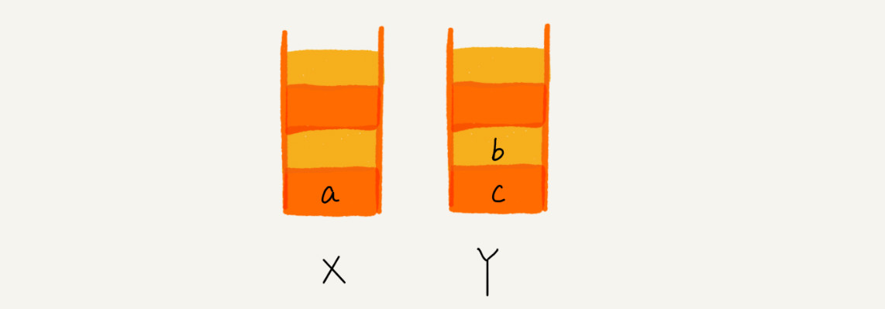

# 栈/队列

## 概述

**栈是一种“操作受限”的线性表**，只允许在一端插入和删除数据。**后进者先出，先进者后出**，这就是典型的“栈”结构。

实际上，栈既可以用数组来实现，也可以用链表来实现。

+ 用数组实现的栈，我们叫作**顺序栈**
+ 用链表实现的栈，我们叫作**链式栈**


## 应用

### 表达式求值


实际上，编译器就是通过两个栈来实现的。其中一个**保存操作数的栈**，另一个是**保存运算符的栈**。我们从左向右遍历表达式，当遇到数字，我们就直接压入操作数栈；当遇到运算符，就与运算符栈的栈顶元素进行比较。

+ 如果比运算符栈顶元素的优先级高，就将当前运算符压入栈
+ 如果比运算符栈顶元素的优先级低或者相同，从运算符栈中取栈顶运算符，从操作数栈的栈顶取 2 个操作数，然后进行计算，再把计算完的结果压入操作数栈，继续比较。


### 括号匹配

我们用栈来保存未匹配的左括号，从左到右依次扫描字符串。当扫描到左括号时，则将其压入栈中；当扫描到右括号时，从栈顶取出一个左括号。如果能够匹配，比如“(”跟“)”匹配，“[”跟“]”匹配，“{”跟“}”匹配，则继续扫描剩下的字符串。如果扫描的过程中，遇到不能配对的右括号，或者栈中没有数据，则说明为非法格式。


### 浏览器

顺序查看了 a，b，c 三个页面，我们就依次把 a，b，c 压入栈，这个时候，两个栈的数据就是这个样子


当你通过浏览器的后退按钮，从页面 c 后退到页面 a 之后，我们就依次把 c 和 b 从栈 X 中弹出，并且依次放入到栈 Y。这个时候，两个栈的数据就是这个样子：



又点击前进按钮回到 b 页面，我们就把 b 再从栈 Y 中出栈，放入栈 X 中。此时两个栈的数据是这个样子


通过页面 b 又跳转到新的页面 d 了，页面 c 就无法再通过前进、后退按钮重复查看了，所以需要清空栈 Y


## 习题

| 序号 | 题目               | 连接                                                         | 次数 |
| ---- | ------------------ | ------------------------------------------------------------ | ---- |
| 20   | 有效的括号         | https://leetcode-cn.com/problems/valid-parentheses/          | 2    |
| 155  | 最小栈             | https://leetcode-cn.com/problems/min-stack/                  | 2    |
| 84   | 柱状图中最大的矩形 | https://leetcode-cn.com/problems/largest-rectangle-in-histogram | 2    |
| 239  | 滑动窗口最大值     | https://leetcode-cn.com/problems/sliding-window-maximum      | 2    |
| 641  | 设计循环双端队列   | https://leetcode-cn.com/problems/design-circular-deque       | 2    |
| 42   | 接雨水             | https://leetcode-cn.com/problems/trapping-rain-water/        | 2    |


## 柱状图中最大的矩形

- 入栈: 当前元素如果大于上一个元素，说明上一个元素是当前元素的左边边界，可是当前元素还没有找到右边界，所以入栈
- 出栈: 当前元素小于上一个元素，说明当前元素是上一个元素的右边边界。此时有了左边界和右边界，应该进行计算
- 宽计算方法:  右边界（不包括）- 左边界（包括）- 1
- 还在栈中的数字一定是从小到大排列，因为比当前元素小的已经被弹出栈中

```java
class Solution {
    public int largestRectangleArea(int[] heights) {

        if (heights == null) return 0;
        if (heights.length == 1) return heights[0];

        Stack<Integer> stack = new Stack<>();

        int area = 0;
        for(int i = 0; i < heights.length; i++) {

            while(!stack.isEmpty() && heights[stack.peek()] > heights[i]) {

                int height = heights[stack.pop()];
                int width;
                if (!stack.isEmpty()) {
                    width = i - stack.peek() - 1;
                } else {
                    width = i;
                }
                area = Math.max(area, height * width);
            }
            stack.push(i);
        }

        
        int len = stack.pop() + 1;
        while (!stack.isEmpty()) {
            int height = heights[stack.pop()];
            int width;
            if (!stack.isEmpty()) {
                width = len -stack.peek() - 1;
            } else {
                width = len;
            }
            area = Math.max(area, width * height);
        }
        return area;
    }
}
```


## 双端队列在Array中设计

- Head 是头节点
- Tail 是尾节点的下一个节点
- 通过 Head == Tail 来判断当前链条是否是空，(Tail + 1) % Capactiy == Head 来判断是否链表已满
- 往前移动 (index + 1) % capactiy
- 往后移动 (index + 1 + capacity) % capacity

```java
**class MyCircularDeque {

    /** Initialize your data structure here. Set the size of the deque to be k. */
    int[] arr;
    int front;
    int rear;
    int capacity;
    public MyCircularDeque(int k) {
        capacity = k + 1;
        arr = new int[capacity];
        front = 0;
        rear = 0;
        
    }
    
    /** Adds an item at the front of Deque. Return true if the operation is successful. */
    public boolean insertFront(int value) {
        if (isFull()) return false;
        
        front = (front - 1 + capacity) % capacity;
        arr[front] = value;
        return true; 
    }
    
    /** Adds an item at the rear of Deque. Return true if the operation is successful. */
    public boolean insertLast(int value) {
        if (isFull()) return false;

        arr[rear] = value;
        rear = (rear + 1) % capacity;
        return true;
    }
    
    /** Deletes an item from the front of Deque. Return true if the operation is successful. */
    public boolean deleteFront() {
        if (isEmpty()) return false;
            
        front = (front + 1) % capacity;
        return true;
    }
    
    /** Deletes an item from the rear of Deque. Return true if the operation is successful. */
    public boolean deleteLast() {
        if (isEmpty()) return false;

        rear = (rear - 1 + capacity) % capacity;
        return true;
    }
    
    /** Get the front item from the deque. */
    public int getFront() {
        if (isEmpty()) return -1;

        return arr[front];
    }
    
    /** Get the last item from the deque. */
    public int getRear() {
        if (isEmpty()) return -1;

        return arr[(rear - 1 + capacity) % capacity];
    }
    
    /** Checks whether the circular deque is empty or not. */
    public boolean isEmpty() {
        return front == rear;
    }
    
    /** Checks whether the circular deque is full or not. */
    public boolean isFull() {
        return (rear + 1) % capacity == front;
    }
}**
```