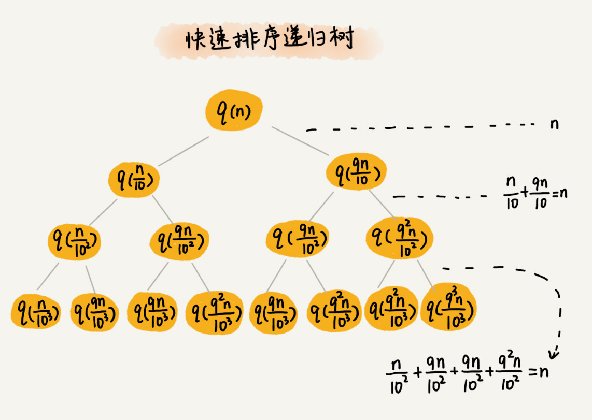
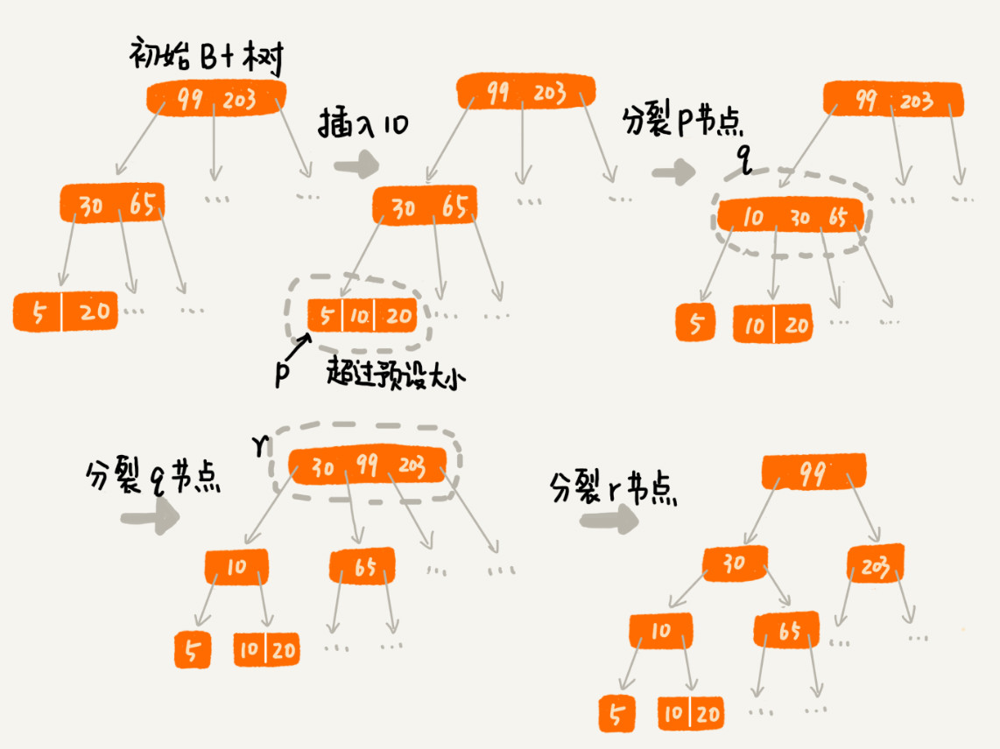

# 树

## 概述

A 节点就是 B 节点的**父节点**，B 节点是 A 节点的**子节点**。B、C、D 这三个节点的父节点是同一个节点，所以它们之间互称为**兄弟节点**。我们把没有父节点的节点叫做**根节点**，也就是图中的节点 E。我们把没有子节点的节点叫做叶子节点或者**叶节点**


节点高度：节点到叶子节点的最长路劲

节点深度：根节点到这个节点的边的个数

节点层数：节点深度＋１

树的高度：根节点高度


### 二叉树

二叉树，顾名思义，每个节点最多有两个“叉”，也就是两个子节点，分别是左子节点和右子节点。

编号 2 的二叉树中，**叶子节点全都在最底层，除了叶子节点之外，每个节点都有左右两个子节点，这种二叉树就叫做满二叉树**。

编号 3 的二叉树中，**叶子节点都在最底下两层，最后一层的叶子节点都靠左排列，并且除了最后一层，其他层的节点个数都要达到最大，这种二叉树叫做完全二叉树**


#### 存储

**链式存储法**，每个节点有三个字段，其中一个存储数据，另外两个是指向左右子节点的指针


**顺序存储法**，我们把根节点存储在下标 i = 1 的位置，那左子节点存储在下标 2 * i = 2 的位置，右子节点存储在 2 * i + 1 = 3 的位置


#### 遍历

经典的方法有三种，**前序遍历、中序遍历和后序遍历**。其中，前、中、后序，表示的是节点与它的左右子树节点遍历打印的先后顺序。

+ 前序遍历是指，对于树中的任意节点来说，先打印这个节点，然后再打印它的左子树，最后打印它的右子树
+ 中序遍历是指，对于树中的任意节点来说，先打印它的左子树，然后再打印它本身，最后打印它的右子树
+ 后序遍历是指，对于树中的任意节点来说，先打印它的左子树，然后再打印它的右子树，最后打印这个本身

```JAVA

void preOrder(Node* root) {
  if (root == null) return;
  print root // 此处为伪代码，表示打印root节点
  preOrder(root->left);
  preOrder(root->right);
}

void inOrder(Node* root) {
  if (root == null) return;
  inOrder(root->left);
  print root // 此处为伪代码，表示打印root节点
  inOrder(root->right);
}

void postOrder(Node* root) {
  if (root == null) return;
  postOrder(root->left);
  postOrder(root->right);
  print root // 此处为伪代码，表示打印root节点
}
```

#### 查找操作

我们先取根节点，如果它等于我们要查找的数据，那就返回。如果要查找的数据比根节点的值小，那就在左子树中递归查找；如果要查找的数据比根节点的值大，那就在右子树中递归查找

```JAVA
public class BinarySearchTree {
  private Node tree;

  public Node find(int data) {
    Node p = tree;
    while (p != null) {
      if (data < p.data) p = p.left;
      else if (data > p.data) p = p.right;
      else return p;
    }
    return null;
  }

  public static class Node {
    private int data;
    private Node left;
    private Node right;

    public Node(int data) {
      this.data = data;
    }
  }
}
```

#### 插入操作

+ 如果要插入的数据比节点的数据大，并且节点的右子树为空，就将新数据直接插到右子节点的位置；如果不为空，就再递归遍历右子树，查找插入位置。
+ 如果要插入的数据比节点数值小，并且节点的左子树为空，就将新数据插入到左子节点的位置；如果不为空，就再递归遍历左子树，查找插入位置。

```java
public void insert(int data) {
  if (tree == null) {
    tree = new Node(data);
    return;
  }

  Node p = tree;
  while (p != null) {
    if (data > p.data) {
      if (p.right == null) {
        p.right = new Node(data);
        return;
      }
      p = p.right;
    } else { // data < p.data
      if (p.left == null) {
        p.left = new Node(data);
        return;
      }
      p = p.left;
    }
  }
}
```

#### 删除操作

+ 如果要删除的节点没有子节点，我们只需要直接将父节点中，指向要删除节点的指针置为 null。比如图中的删除节点 55。
+ 如果要删除的节点只有一个子节点（只有左子节点或者右子节点），我们只需要更新父节点中，指向要删除节点的指针，让它指向要删除节点的子节点就可以了。比如图中的删除节点 13。
+ 第三种情况是，如果要删除的节点有两个子节点，这就比较复杂了。我们需要找到这个节点的右子树中的最小节点，把它替换到要删除的节点上。然后再删除掉这个最小节点，比如图中的删除节点 18


```java

public void delete(int data) {
  Node p = tree; // p指向要删除的节点，初始化指向根节点
  Node pp = null; // pp记录的是p的父节点
  while (p != null && p.data != data) {
    pp = p;
    if (data > p.data) p = p.right;
    else p = p.left;
  }
  if (p == null) return; // 没有找到

  // 要删除的节点有两个子节点
  if (p.left != null && p.right != null) { // 查找右子树中最小节点
    Node minP = p.right;
    Node minPP = p; // minPP表示minP的父节点
    while (minP.left != null) {
      minPP = minP;
      minP = minP.left;
    }
    p.data = minP.data; // 将minP的数据替换到p中
    p = minP; // 下面就变成了删除minP了
    pp = minPP;
  }

  // 删除节点是叶子节点或者仅有一个子节点
  Node child; // p的子节点
  if (p.left != null) child = p.left;
  else if (p.right != null) child = p.right;
  else child = null;

  if (pp == null) tree = child; // 删除的是根节点
  else if (pp.left == p) pp.left = child;
  else pp.right = child;
}
```

#### 时间复杂度分析

完全二叉树来说，最后一层的节点个数有点儿不遵守上面的规律了。它包含的节点个数在 1 个到 2^(L-1) 个之间（我们假设最大层数是 L）。　L 的范围是[log2(n+1), log2n +1]。完全二叉树的层数小于等于 log2n +1，也就是说，完全二叉树的高度小于等于 log2n。


### 红黑树

平衡二叉查找树中“平衡”的意思，其实就是让整棵树左右看起来比较“对称”、比较“平衡”，不要出现左子树很高、右子树很矮的情况。这样就能让整棵树的高度相对来说低一些，相应的插入、删除、查找等操作的效率高一些。


红黑树中的节点，一类被标记为黑色，一类被标记为红色。除此之外，一棵红黑树还需要满足这样几个要求

+ 根节点是黑色的
+ 每个叶子节点都是黑色的空节点（NIL），也就是说，叶子节点不存储数据
+ 任何相邻的节点都不能同时为红色，也就是说，红色节点是被黑色节点隔开的
+ 每个节点，从该节点到达其可达叶子节点的所有路径，都包含相同数目的黑色节点
+ 红黑树的高度近似 2log2n


### 递归树

#### 归并排序


因为每次分解都是一分为二，我们把时间上的消耗记作常量 1。归并算法中比较耗时的是归并操作，也就是把两个子数组合并为大数组。**每一层归并操作消耗的时间总和是一样的，跟要排序的数据规模有关。我们把每一层归并操作消耗的时间记作 n。**

只要知道这棵树的高度 h，用高度 h 乘以每一层的时间消耗 n，就可以得到总的时间复杂度 O(n∗h)

归并排序递归树是一棵满二叉树。满二叉树的高度大约是 log2n，所以，归并排序递归实现的**时间复杂度就是 O(nlogn)。**


#### 快速排序

我们假设平均情况下，每次分区之后，两个分区的大小比例为 1:k。当 k=9 时，如果用递推公式的方法来求解时间复杂度的话，递推公式就写成 T(n)=T(10n)+T(109n)+n。



从根节点 n 到叶子节点 1，递归树中最短的一个路径每次都乘以 101，最长的一个路径每次都乘以 109。通过计算，我们可以得到，从根节点到叶子节点的最短路径是 log10n，最长的路径是 log910n


遍历数据的个数总和就介于 **nlog10n 和 nlog910n 之间**。根据复杂度的大 O 表示法，对数复杂度的底数不管是多少，我们统一写成 logn，所以，**当分区大小比例是 1:9 时，快速排序的时间复杂度仍然是 O(nlogn)。**


#### 斐波那契数列

f(n) 分解为 f(n−1) 和 f(n−2)，每次数据规模都是 −1 或者 −2，叶子节点的数据规模是 1 或者 2。所以，从根节点走到叶子节点，每条路径是长短不一的。如果每次都是 −1，那最长路径大约就是 n；如果每次都是 −2，那最短路径大约就是 2n。


如果路径长度都为 n，那这个总和就是 2n−1。如果路径长度都是 2n ，那整个算法的总的时间消耗就是 22n−1。算法的时间复杂度就介于 O(2n) 和 O(22n) 之间。


#### 全排列

如果我们确定了最后一位数据，那就变成了求解剩下 n−1 个数据的排列问题。而最后一位数据可以是 n 个数据中的任意一个，因此它的取值就有 n 种情况。所以，“n 个数据的排列”问题，就可以分解成 n 个“n−1 个数据的排列”的子问题。


第一层分解有 n 次交换操作，第二层有 n 个节点，每个节点分解需要 n−1 次交换，所以第二层总的交换次数是 n∗(n−1)。第三层有 n∗(n−1) 个节点，每个节点分解需要 n−2 次交换，所以第三层总的交换次数是 n∗(n−1)∗(n−2)。

```
n + n*(n-1) + n*(n-1)*(n-2) +... + n*(n-1)*(n-2)*...*2*1
```

这个公式的求和比较复杂，我们看最后一个数，n∗(n−1)∗(n−2)∗…∗2∗1 等于 n!，而前面的 n−1 个数都小于最后一个数，所以，总和肯定小于 n∗n!，也就是说，**全排列的递归算法的时间复杂度大于 O(n!)，小于 O(n∗n!)**


## 应用

### B+ 索引

#### 区间查找

为了让二叉查找树支持按照区间来查找数据，我们把每个叶子节点串在一条链表上，链表中的数据是从小到大有序的。如果我们要求某个区间的数据。我们只需要拿区间的起始值，在树中进行查找，当查找到某个叶子节点之后，我们再顺着链表往后遍历，直到链表中的结点数据值大于区间的终止值为止。


#### IO操作

比如，我们给一亿个数据构建二叉查找树索引，那索引中会包含大约 1 亿个节点，每个节点假设占用 16 个字节，那就需要大约 1GB 的内存空间

将索引存储在**硬盘中的方案**，尽管减少了内存消耗，但是在数据查找的过程中，需要读取磁盘中的索引，**因此数据查询效率就相应降低很多。**

如果我们把索引构建成 m 叉树，高度是不是比二叉树要小呢？如图所示，给 16 个数据构建二叉树索引，树的高度是 4，查找一个数据，就需要 4 个磁盘 IO 操作。不管是内存中的数据，还是磁盘中的数据，操作系统都是按页（一页大小通常是 4KB，这个值可以通过 getconfig PAGE_SIZE 命令查看）来读取的。所以，**我们在选择 m 大小的时候，要尽量让每个节点的大小等于一个页的大小。读取一个节点，只需要一次磁盘 IO 操作。**


#### 插入分裂

这个节点的大小超过了一个页的大小，读取这样一个节点，就会导致多次磁盘 IO 操作。我们只需要将这个节点分裂成两个节点。但是，节点分裂之后，其上层父节点的子节点个数就有可能超过 m 个。不过这也没关系，我们可以用同样的方法，将父节点也分裂成两个节点。这种级联反应会从下往上，一直影响到根节点



#### 删除合并

我们可以设置一个阈值。在 B+ 树中，这个阈值等于 m/2。如果某个节点的子节点个数小于 m/2，我们就将它跟相邻的兄弟节点合并。不过，合并之后节点的子节点个数有可能会超过 m。针对这种情况，我们可以借助插入数据时候的处理方法，再分裂节点。


### B 树

B+ 树中的节点不存储数据，只是索引，而 B 树中的节点存储数据

B 树中的叶子节点并不需要链表来串联。


## 习题

| 序号 | 题目                                                         | 次数 |
| ---- | ------------------------------------------------------------ | ---- |
| 94   | [二叉树的中序遍历](https://leetcode-cn.com/problems/binary-tree-inorder-traversal/) | 3    |
| 144  | [二叉树的前序遍历](https://leetcode-cn.com/problems/binary-tree-preorder-traversal/) | 3    |
| 590  | [N叉树的后序遍历](https://leetcode-cn.com/problems/n-ary-tree-postorder-traversal/) | 3    |
| 589  | [N叉树的前序遍历](https://leetcode-cn.com/problems/n-ary-tree-preorder-traversal/) | 3    |
| 226  | [翻转二叉树](https://leetcode-cn.com/problems/invert-binary-tree/) | 3    |
| 96   | [验证二叉搜索树](https://leetcode-cn.com/problems/validate-binary-search-tree/) | 3    |
| 104  | [二叉树的最大深度](https://leetcode-cn.com/problems/maximum-depth-of-binary-tree/) | 3    |
| 111  | [二叉树的最小深度](https://leetcode-cn.com/problems/minimum-depth-of-binary-tree/) | 3    |
| 297  | [二叉树的序列化与反序列化](https://leetcode-cn.com/problems/serialize-and-deserialize-binary-tree/) | 3    |
| 236  | [二叉树的最近公共祖先](https://leetcode-cn.com/problems/lowest-common-ancestor-of-a-binary-tree/) | 2    |
| 105  | [从前序与中序遍历序列构造二叉树](https://leetcode-cn.com/problems/construct-binary-tree-from-preorder-and-inorder-traversal/) | 2    |
| 106  | [从中序与后序遍历序列构造二叉树](https://leetcode-cn.com/problems/construct-binary-tree-from-inorder-and-postorder-traversal/) | 2    |
| 117  | [填充每个节点的下一个右侧节点指针 II](https://leetcode-cn.com/problems/populating-next-right-pointers-in-each-node-ii/) | 2    |
| 428  | [序列化和反序列化 N 叉树](https://leetcode-cn.com/problems/serialize-and-deserialize-n-ary-tree/) | 2    |


