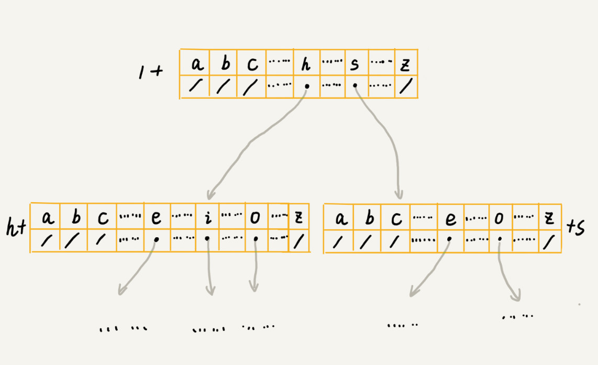

# 字典树

## 概述


Trie 树的本质，就是利用字符串之间的公共前缀，将重复的前缀合并在一起。最后构造出来的就是下面这个图中的样子。

+ 根节点不包含任何信息
+ 每个节点表示一个字符串中的字符
+ 从根节点到红色节点的一条路径表示一个字符串


### 实现

通过一个下标与字符一一映射的数组，来存储子节点的指针



```java
class Trie {

    /** Initialize your data structure here. */
    Node root;
    public Trie() {
        this.root = new Node();
    }
    
    /** Inserts a word into the trie. */
    public void insert(String word) {
        if (word == null || word.length() == 0) return;
        
        Node node = root;
        for(int i = 0; i < word.length(); i++) {
            
            Node next;
            if (node.containsKey(word.charAt(i))) {
                next = node.get(word.charAt(i));
            } else {
                next = new Node();
            }
            node.put(word.charAt(i), next);
            node = next;
        }
        node.setEnd(true);
    }
    
    /** Returns if the word is in the trie. */
    public boolean search(String word) {
        
        Node node = root;
        for(int i = 0; i < word.length(); i ++) {
            if (!node.containsKey(word.charAt(i))) {
                return false;
            }

            node = node.get(word.charAt(i));
        }

        return node.isEnd();
    }
    
    /** Returns if there is any word in the trie that starts with the given prefix. */
    public boolean startsWith(String prefix) {

        Node node = root;
        for(int i = 0; i < prefix.length(); i ++) {
            if (!node.containsKey(prefix.charAt(i))) {
                return false;
            }

            node = node.get(prefix.charAt(i));
        }

        return true;
    }
}


class Node {

    Node[] child;
    boolean isEnd;

    public Node() {
        child = new Node[26];
        isEnd = false;
    }

    public boolean containsKey(char ch) {
        return child[ch - 'a'] != null;
    }

    public Node get(char ch) {
        return child[ch - 'a'];
    }

    public void put(char ch, Node node) {
        child[ch - 'a'] = node;
    }

    public void setEnd(boolean isEnd) {
        this.isEnd = isEnd;
    }

    public boolean isEnd() {
        return this.isEnd;
    }
}
```


### 应用

Trie 树最有优势的是查找前缀匹配的字符串，比如搜索引擎中的关键词提示功能这个场景

+ 输入法自动补全功能
+ IDE 代码编辑器自动补全功能
+ 浏览器网址输入的自动补全功能等


## 习题

| 序号 | 题目次数                                                     | 次数 |
| ---- | ------------------------------------------------------------ | ---- |
| 94   | [实现 Trie (前缀树)](https://leetcode-cn.com/problems/implement-trie-prefix-tree/) | 2    |
| 212  | [单词搜索 II](https://leetcode-cn.com/problems/word-search-ii/) | 1    |
| 677  | [键值映射](https://leetcode-cn.com/problems/map-sum-pairs/)  | 1    |
| 648  | [单词替换](https://leetcode-cn.com/problems/replace-words/)  | 1    |

### 实现Tire

+ 实现node里面的`containsKey(String), put(char), get(char)`  方法
+ 实现Tire里面的`insert(String), search(String)` 方法

```JAVA
class Trie {

    /** Initialize your data structure here. */
    Node root;
    public Trie() {
        this.root = new Node();
    }
    
    /** Inserts a word into the trie. */
    public void insert(String word) {
        if (word == null || word.length() == 0) return;
        
        Node node = root;
        for(char ch: word.toCharArray()) {
            
            if (!node.containsKey(ch)) {
                node.put(ch, new Node());
            }
            node = node.get(ch);
        }
        node.setEnd(true);
    }
    
    /** Returns if the word is in the trie. */
    public boolean search(String word) {
        
        Node node = root;
        for(char ch: word.toCharArray()) {
            if (!node.containsKey(ch)) {
                return false;
            }
            node = node.get(ch);
        }
        return node.isEnd();
    }
    
    /** Returns if there is any word in the trie that starts with the given prefix. */
    public boolean startsWith(String prefix) {

        Node node = root;
        for(char ch: prefix.toCharArray()) {
            if (!node.containsKey(ch)) {
                return false;
            }
            node = node.get(ch);
        }
        return true;
    }
}


class Node {

    Node[] child;
    boolean isEnd;

    public Node() {
        child = new Node[26];
        isEnd = false;
    }

    public boolean containsKey(char ch) {
        return child[ch - 'a'] != null;
    }

    public Node get(char ch) {
        return child[ch - 'a'];
    }

    public void put(char ch, Node node) {
        child[ch - 'a'] = node;
    }

    public void setEnd(boolean isEnd) {
        this.isEnd = isEnd;
    }

    public boolean isEnd() {
        return this.isEnd;
    }
}
```


### 单词替换

+ 构建trie树
+ 利用trie树进行替换

```JAVA
class Solution {

    Node root;

    public String replaceWords(List<String> dictionary, String sentence) {
        root = new Node();
        for(String word: dictionary) {
            insert(word);
        }

        String[] words = sentence.split(" ");
        String[] ans = new String[words.length];
        String root = "";
        for(int i = 0; i < words.length; i++) {
            ans[i] = search(words[i]);
            if ("".equals(ans[i])) {
                ans[i] = words[i];
            }
        }

        StringBuilder sb = new StringBuilder();
        for(int i = 0; i < ans.length; i++) {
            sb.append(ans[i]);
            if (i != ans.length - 1) sb.append(" ");
        }
        return sb.toString();
    }


    public void insert(String word) {
        Node node = root;
        for(char ch: word.toCharArray()) {
            if (!node.containsKey(ch)) {
                Node next = new Node();
                node.put(ch, next);
            }
            node = node.get(ch);
        }
        node.setEnd(true);
    }


    public String search(String word) {
        
        StringBuilder sb = new StringBuilder();
        Node node = root;
        for(char ch: word.toCharArray()) {

            if (node.isEnd()) return sb.toString();
            
            if (node.containsKey(ch)) {
                sb.append(ch);    
                node = node.get(ch);
            } else {
                return "";
            }
        }
        return sb.toString();
    }


    class Node {

        private boolean isEnd;

        private Node[] child;

        public Node() {
            this.isEnd = false;
            this.child = new Node[26];
        }

        public boolean containsKey(char ch) {
            return child[ch - 'a'] != null;
        }

        public Node get(char ch) {
            return this.child[ch - 'a'];
        }

        public void put(char ch, Node node) {
            this.child[ch - 'a'] = node;
        }

        public void setEnd(boolean isEnd) {
            this.isEnd = isEnd; 
        }

        public boolean isEnd() {
            return this.isEnd;
        }
    }
}
```


